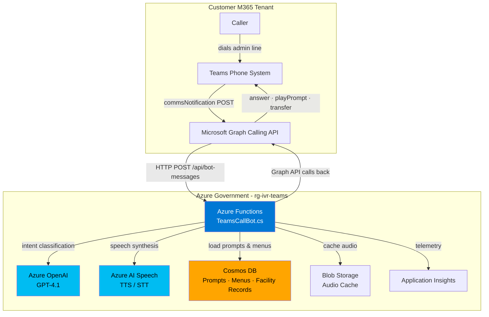
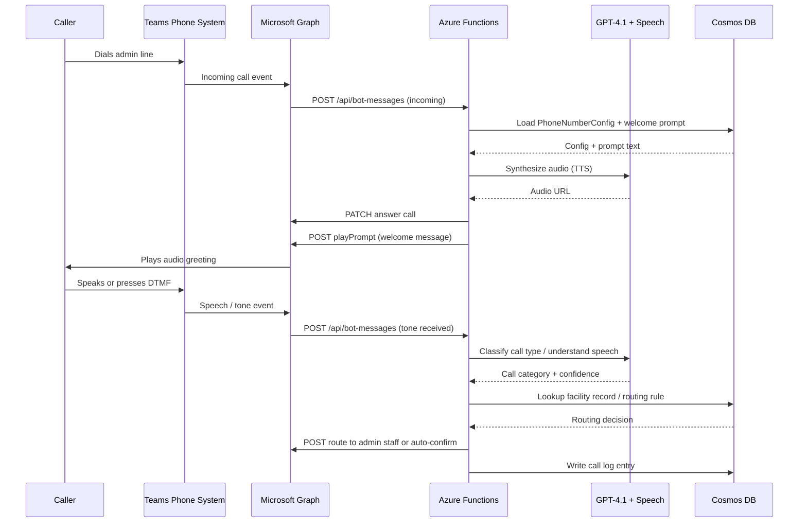
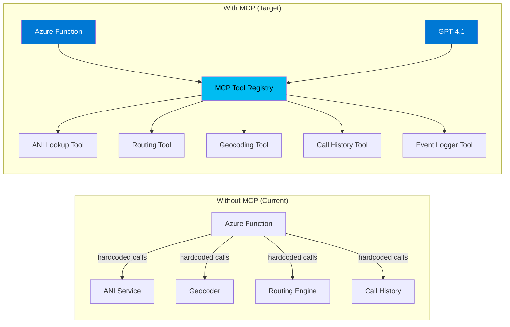
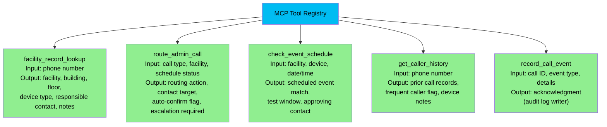
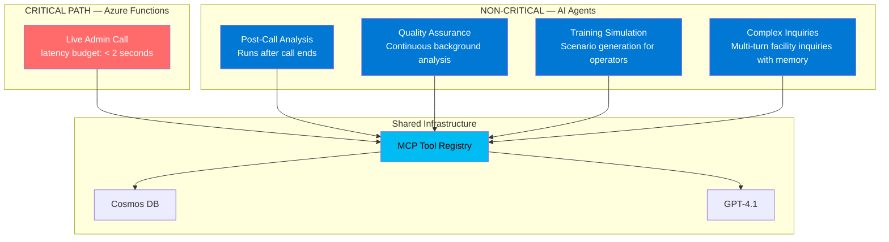
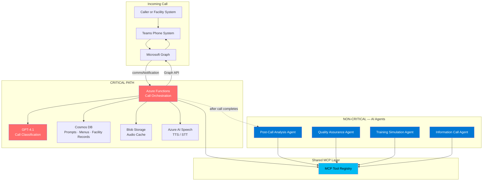

# AI Architecture & Agentic Strategy — Admin Call Automation IVR

**Document Version:** 3.0  
**Date:** July 27, 2026  
**Status:** Active Architecture  
**Audience:** Field engineers, architects, program leadership, customer stakeholders

---

## Executive Summary

This document describes the AI architecture powering the Admin Call Automation IVR system and makes the case for why this approach is fundamentally superior to relying on Microsoft Teams built-in auto-attendant features or a traditional telephony call manager.

The system's core mission is to **relieve 911 operators and dispatch personnel from receiving routine administrative calls** — fire alarm tests, door access events, HVAC alerts, security system notifications, maintenance check-ins, and other non-emergency facility calls that currently consume operator time and create noise in emergency dispatch environments. The AI handles these calls automatically, logs them, notifies the appropriate facility personnel, and escalates to a human operator only when the call represents a genuine exception.

The system uses **Azure OpenAI GPT-4.1**, **Azure AI Speech**, and a custom orchestration layer to deliver an intelligent, context-aware call handling experience that no off-the-shelf product can replicate. It runs entirely within the **Azure Government cloud**, maintaining FedRAMP and IL compliance boundaries.

The forward architecture builds on this foundation using **Model Context Protocol (MCP)** to standardize how AI tools are exposed and called, and introduces **AI Agents** for non-critical reasoning tasks — creating a system that continuously improves over time.

### Key Positions

| Position | Rationale |
|---|---|
| **Do not use Teams built-in Auto-Attendant** | No NLU, no facility database integration, no dynamic routing, no AI reasoning |
| **Do not rely on a traditional call manager** | Rule-based only, cannot distinguish a routine alarm test from a real event without AI |
| **Use custom AI orchestration** | Understands call intent, classifies admin vs. exception, integrates with facility data |
| **Adopt MCP for tool interfaces** | Standardizes AI-tool contracts, improves testability and reuse |
| **Use AI Agents selectively** | Agents excel at non-critical reasoning; Functions own the live call processing path |

---

## Table of Contents

1. [Why Not Built-In?](#why-not-built-in)
2. [Current AI Architecture](#current-ai-architecture)
3. [What the AI Actually Does](#what-the-ai-actually-does)
4. [AI Capabilities: The Differentiators](#ai-capabilities-the-differentiators)
5. [MCP Integration Strategy](#mcp-integration-strategy)
6. [AI Agent Strategy](#ai-agent-strategy)
7. [Agent vs. Function: Choosing the Right Tool](#agent-vs-function-choosing-the-right-tool)
8. [Hybrid Architecture](#hybrid-architecture)
9. [Future AI Roadmap](#future-ai-roadmap)
10. [Decision Matrix](#decision-matrix)

---

## Why Not Built-In?

### The Case Against Teams Auto-Attendant

Microsoft Teams includes a built-in Auto-Attendant feature. For general office call routing it is adequate. For admin call automation in a public safety environment, it is fundamentally insufficient. Here is why:

| Capability | Teams Auto-Attendant | This AI System |
|---|---|---|
| **Natural language understanding** | ❌ None — DTMF tones and simple keyword triggers only | ✅ Full NLU via GPT-4.1 — classifies call intent regardless of how it is phrased |
| **Facility database integration** | ❌ Not supported | ✅ Real-time lookup of caller/device identity, facility, and schedule from provisioned databases |
| **Scheduled event awareness** | ❌ No awareness of planned tests or maintenance windows | ✅ Cross-references incoming calls against known scheduled events to auto-confirm routine tests |
| **Dynamic routing logic** | ❌ Fixed decision trees configured in the Teams admin center | ✅ AI-driven routing that adapts to call type, facility, time of day, and caller history |
| **Customizable per facility** | ❌ One-size-fits-all configuration | ✅ Per-facility prompts, menus, and routing rules stored in Cosmos DB |
| **Caller history awareness** | ❌ None | ✅ Prior call records identify repeat alarm sources, frequent testers, and known devices |
| **Audit trail and analytics** | ❌ Basic call logs only | ✅ Full call event ledger with AI-generated summaries for compliance and review |
| **Integration with facility systems** | ❌ No external data source support | ✅ Extensible via MCP tools — alarm panels, access control, CMMS, and scheduling systems |
| **GovCloud compliance boundary** | ❌ Commercial Teams, not Azure Gov | ✅ Deployed entirely within Azure Government (USGov Virginia) |

### The Case Against a Traditional Call Manager

Traditional PBX-based IVR systems (Avaya, Cisco CUCM, Genesys, etc.) use rule-based decision trees. They work reasonably well for structured, predictable interactions. Admin call automation presents challenges that expose the limits of that model.

Consider a fire alarm panel that calls in with a test notification. A traditional IVR can detect the DTMF tones the panel sends — but it cannot understand a spoken message from a technician calling to report the same test, cross-reference whether the test was scheduled, confirm the right facility contact is notified, or log the event with enough context for a compliance audit. If the call format deviates even slightly from what the menu tree expects, the system times out, replays the prompt, or drops the call. Meanwhile, the scenario that mattered most — a call that should have been escalated because the test was *not* scheduled — gets handled the same way as every other call.

The AI system understands the call's intent regardless of phrasing, checks the event schedule, routes accordingly, and logs a structured record — all without operator intervention.

Additional limitations of traditional call managers:

- **Reprogramming requires vendor involvement or specialized staff** — updating a menu tree is a change-management event. In this system, prompts and menus are records in Cosmos DB, editable in the Admin Portal without a deployment.
- **No schedule or context awareness** — a traditional IVR cannot compare an incoming alarm call against a known maintenance schedule. This system can, allowing it to auto-confirm expected events and flag unexpected ones.
- **No learning** — a traditional IVR cannot improve from patterns in historical calls. An AI system can.
- **No speech synthesis flexibility** — pre-recorded audio files must be re-recorded when scripts change. This system generates speech on demand via Azure AI Speech TTS.
- **No context retention** — traditional systems have no memory across a call session. The AI maintains full conversation state, which matters for multi-step confirmation flows.

---

## Current AI Architecture

### Deployed Components

The system is live in Azure Government, resource group `rg-ivr-teams`.

| Component | Service | Role |
|---|---|---|
| **Language Model** | Azure OpenAI GPT-4.1 | Natural language understanding, intent classification, response generation |
| **Speech Synthesis** | Azure AI Speech (TTS) | Generates caller-facing audio prompts on demand |
| **Speech Recognition** | Azure AI Speech (STT) | Transcribes caller speech input in real-time |
| **Orchestration** | Azure Functions (.NET 8) | Handles all call events, invokes AI services, enforces business logic |
| **Call Transport** | Microsoft Graph Calling API | Receives and controls calls via commsNotifications |
| **Configuration Store** | Azure Cosmos DB | Prompts, menus, phone number configs, ANI records |
| **Audio Cache** | Azure Blob Storage | Stores generated TTS audio to avoid re-synthesis on repeat prompts |
| **Identity** | Microsoft Entra / Bot App Registration | Authenticates bot with Teams and Microsoft Graph |
| **Observability** | Azure Application Insights | End-to-end telemetry, latency tracking, error alerting |

### High-Level System Architecture

### Call Event Flow

Every interaction with the caller arrives as a `commsNotification` HTTP POST from Microsoft Graph to the Function App. The Function App is the single intelligent orchestrator — it evaluates the notification type, queries Cosmos DB for the appropriate prompt or routing rule, calls Azure OpenAI or Azure AI Speech as needed, then issues Graph API calls back to control the call (answer, play audio, collect tones, transfer).

---

## What the AI Actually Does

### Intent Classification

When a caller speaks, the speech-to-text engine transcribes the audio. That transcript is then passed to GPT-4.1 for intent classification. The model determines:

- What type of admin event is being reported (alarm test, access event, maintenance check-in, HVAC alert, security notification, etc.)
- Whether the event matches a scheduled activity or is an unexpected occurrence requiring escalation
- Which facility and device the call originates from, based on the calling number and spoken context
- Which menu branch or routing action to take next (auto-confirm, notify staff, log and close, or escalate)

This means the system correctly handles the full range of admin call formats — structured DTMF from an alarm panel, a spoken message from a technician, or a combination of both — without requiring operator involvement for routine events.

### Dynamic Prompt Management

Prompts (what the caller hears) are not hard-coded audio files. They are text records in Cosmos DB. When a prompt needs to play:

1. The Function App loads the prompt text from Cosmos DB
2. If a cached audio file exists in Blob Storage, it plays that directly
3. If not, Azure AI Speech synthesizes the text to audio in real-time, caches it, and plays it

This means a prompt can be updated in the Admin Portal at any time without any deployment, recompilation, or recording session. A supervisor can change the greeting for a holiday, update after-hours messaging, or add new menu options in minutes.

### Menu and Routing Logic

Menus are also stored in Cosmos DB, not in code. Each menu defines:

- The prompt to play (linked to a Cosmos DB prompt record)
- The DTMF options (which key goes where)
- The fallback behavior on timeout or invalid input
- The transfer target when routing to admin staff or escalating to operations

The AI layer sits above this — it can understand a spoken response and map it to the correct menu branch without requiring the caller to press a number.

### Facility Record Lookup

Facility records in Cosmos DB associate a calling number with a location, building, floor, device type, responsible contact, and any special instructions. When a call arrives, the Function App looks up the calling number and pre-populates full facility context before any words are spoken. This means the system already knows the call is coming from Building 4's fire panel on the third floor before the caller says a word — allowing it to make faster, more accurate routing decisions and produce richer log entries.

---

## AI Capabilities: The Differentiators

### Natural Language Understanding

Built-in auto-attendants and traditional IVR systems understand keypad input and, at best, a handful of rigid voice commands ("say yes or no"). GPT-4.1 understands natural language at human level. When a technician calls in and says *"This is a scheduled monthly test of the suppression system in Building 6, panel 3"*, a traditional IVR times out with no matching keyword and replays the main menu. This system classifies the call as a scheduled test, cross-references the maintenance calendar, auto-confirms with the technician, notifies the facility manager, and writes a compliance log entry — all without an operator.

### Adaptive Conversation

A traditional system follows a fixed script. This system can:

- Ask clarifying questions when the call type or facility is ambiguous
- Acknowledge what the caller said before proceeding ("Got it — logging a monthly fire suppression test for Building 6")
- Shorten or skip prompts if the caller's intent is already clear from prior speech or DTMF input
- Handle callers who provide information out of sequence without becoming confused

### Configurable Without Code

Every facility deployment can have its own:

- **Welcome message** — customized to the organization or building
- **After-hours behavior** — different prompts and routing when the facility is closed or staff is unavailable
- **Alarm verification flow** — multi-step DTMF menus for alarm panels and security systems
- **Scheduled event awareness** — known test windows where the system auto-confirms without prompting
- **Escalation targets** — which operations desk, facility manager, or on-call contact to notify for unplanned events

None of this requires a code change or a new deployment. All of it is data in Cosmos DB, manageable from the Admin Portal.

### Varied Caller Types

Admin calls come from a wide range of sources — automated alarm panels sending DTMF tones, technicians calling from noisy mechanical rooms, security staff using handheld radios, and facility management systems generating automated voice notifications. Azure AI Speech STT is tuned for telephony audio quality and handles all of these input types. The combination of STT and GPT-4.1 reasoning means the system extracts intent reliably regardless of input quality or caller type.

### Full Audit Trail

Every call generates a structured event log in Cosmos DB capturing:

- Call start time and source number
- Each DTMF keypress or speech input received
- Each prompt played (with the exact text)
- The routing decision made and the transfer target
- Call end time and disposition

This is a legally defensible, immutable record of every interaction — something a traditional call manager either does not provide or provides only in proprietary formats that are difficult to query.

### Government Cloud Isolation

All AI inference, data storage, and call processing happens inside the Azure Government boundary. No caller data transits commercial Azure. No speech audio or transcripts leave the sovereign cloud. This is a non-negotiable requirement for most DoD and federal agency deployments, and it is satisfied by default in this architecture.

---

## MCP Integration Strategy

### What is MCP?

**Model Context Protocol (MCP)** is an open standard that defines how AI models communicate with external tools and data sources. It creates a clean, documented, version-controlled contract between the AI orchestration layer and the services it needs to call.

In practice, MCP replaces ad-hoc, point-to-point service calls with a structured tool registry. Instead of the Function App having hardwired logic to call Cosmos DB directly, it calls a named MCP tool (`facility_record_lookup`) that has a defined input schema, output schema, and description that the AI model can reason about.

### Why MCP Matters for This System

The current architecture is functional but tightly coupled. Adding a new data source or changing how ANI lookup works requires touching the Function App code, testing, and redeploying. With MCP:

The MCP layer provides:

| Benefit | Explanation |
|---|---|
| **Standardized contracts** | Every tool has a documented input/output schema. The AI model knows exactly what to send and what to expect. |
| **Independent testability** | Each MCP tool can be tested in isolation without spinning up the full call stack. |
| **AI-native discoverability** | GPT-4.1 can read tool descriptions and decide which tools to call — without the orchestration logic being hardcoded. |
| **Reuse across systems** | The same ANI lookup tool can be used by the Function App, by an AI Agent, by a reporting tool, or by a developer testing manually. |
| **Version control** | Tools are versioned independently. A breaking change to the routing algorithm does not require updating every consumer simultaneously. |
| **Reduced coupling** | The Function App does not need to know how ANI lookup works internally — only that it calls the tool and gets a location back. |

### Core Admin Call MCP Tool Library

The following tools form the foundation of the MCP layer:

### MCP Tool Call Flow

When a call arrives and a facility lookup is needed, the flow through the MCP layer is:

1. The Function App receives the `commsNotification` and invokes the `facility_record_lookup` MCP tool with the caller's phone number.
2. The MCP server validates the input against the tool's schema.
3. The tool handler queries the facility records table in Cosmos DB.
4. A structured facility context object is returned to the Function App.
5. The Function App continues call handling with the facility, device, and contact information already in context.

This is the same operation that happens today, but with the added benefits of schema validation, independent testability, and AI model discoverability.

---

## AI Agent Strategy

### What is an AI Agent?

An AI Agent is an autonomous system built on top of a language model that can reason across multiple steps, retain memory within a session, select tools dynamically, and adapt its behavior based on context — rather than following a fixed procedural script.

The distinction from a standard Function call matters. An Azure Function follows a fixed procedural sequence — step 1, step 2, step 3, done. It is deterministic, predictable, and fast. An AI Agent is goal-driven: given an objective such as *"Analyze this call and produce a compliance summary"*, it decides what information it needs, selects and calls the appropriate tools, reasons about the results, and produces a structured output. This makes agents flexible and powerful for complex analytical tasks, though unsuitable for the latency-sensitive live call processing path.

### Where Agents Fit in This System

AI Agents are not a replacement for Azure Functions on the live call processing path. They are an addition for tasks where reasoning, memory, and multi-step analysis are valuable and latency is not the primary constraint.

### The Four Agent Roles

#### Post-Call Analysis Agent

After a call completes, this agent retrieves the full call log, reads the transcript, and produces a structured compliance summary including call category, facility and device details, scheduled vs. unscheduled flag, routing action taken, and whether any follow-up is required. Supervisors and facility managers see this in the Admin Portal without having to review raw logs.

#### Quality Assurance Agent

Runs continuously across all completed calls. Identifies patterns — repeat unscheduled alarm calls from the same panel, prompts that callers consistently mis-answer, facilities with unusually high call volumes, or routing decisions that were overridden. Generates weekly reports and flags anomalies for review.

#### Training Simulation Agent

Generates realistic admin call scenarios for operator training. Takes a scenario type as input (routine fire alarm test, unexpected after-hours access event, HVAC fault notification) and produces a full simulated call with expected DTMF or speech input, correct routing outcome, and compliance log entry. Integrates with the PSTN Simulator so trainers can run drills without needing live calls.

#### Complex Inquiry Agent

Handles multi-step facility inquiries where conversational memory adds value — a facility manager checking on prior call history for a building, a security officer requesting access event logs, or a technician working through a multi-step confirmation flow. Unlike the standard call path, this agent sustains a multi-turn dialogue with context across the entire conversation.

---

## Agent vs. Function: Choosing the Right Tool

### Comparison

| Dimension | Azure Function | AI Agent |
|---|---|---|
| **Execution model** | Deterministic — same input always produces same output | Reasoning-driven — output depends on context and judgment |
| **Latency** | 100–300ms per invocation | 500–1500ms per reasoning step |
| **Conversation memory** | None — stateless by design | Full session memory backed by Cosmos DB |
| **Tool selection** | Hardcoded in logic | AI selects tools dynamically based on goal |
| **Multi-step reasoning** | Manual (developer codes each step) | Automatic (agent plans its own steps) |
| **Error handling** | Explicit try/catch | Agent can retry, rethink, or ask for clarification |
| **Predictability** | Very high — fully auditable | Moderate — reasoning path varies |
| **Cost per invocation** | Very low ($0.001) | Higher ($0.03–0.05 depending on reasoning depth) |
| **Suitability for live admin call routing** | Excellent | Not appropriate (latency + unpredictability) |
| **Suitability for analysis & reasoning** | Poor | Excellent |

### Decision Guide

Apply the following questions in order to choose the right component:

1. **Is this task on the live call critical path?**
   - Yes → Use **Azure Function** (speed and reliability are non-negotiable)
   - No → continue to question 2
2. **Does it require multi-turn conversation or session memory?**
   - Yes → Use **AI Agent**
3. **Does it require complex reasoning over unstructured content?**
   - Yes → Use **AI Agent**
4. **Is it a structured, deterministic operation?**
   - Yes → Use **Azure Function** (with MCP tools as needed)

### Responsibility Assignment

| Task | Azure Function | AI Agent | MCP Required |
|---|---|---|---|
| Answer incoming call | ✅ Primary | ❌ | ✅ |
| Facility record lookup | ✅ Primary | ❌ | ✅ |
| Play audio prompt | ✅ Primary | ❌ | ✅ |
| Collect DTMF tone | ✅ Primary | ❌ | — |
| Classify call type / intent | ✅ via GPT-4.1 | ❌ | — |
| Check event schedule | ✅ Primary | ❌ | ✅ |
| Auto-confirm routine event | ✅ Primary | ❌ | ✅ |
| Route to admin staff | ✅ Primary | ❌ | ✅ |
| Transfer / escalate call | ✅ Primary | ❌ | — |
| Write call log | ✅ Primary | ❌ | ✅ |
| Post-call compliance summary | ❌ | ✅ Primary | ✅ |
| Quality scoring | ❌ | ✅ Primary | ✅ |
| Training scenario generation | ❌ | ✅ Primary | ✅ |
| Complex multi-turn inquiry | ⚠️ Fallback | ✅ Primary | ✅ |
| Anomaly detection | ❌ | ✅ Primary | ✅ |

---

## Hybrid Architecture

### Design Principle

> The live call processing path is the system's core commitment. It must be fast, deterministic, and reliable. AI reasoning lives around it — before calls arrive, after calls complete, and for complex inquiry scenarios — but never blocking a live call that is waiting to be classified and routed.

### Full System Diagram

### Resilience and Fallback

The system is designed with multiple fallback layers so that a failure in any advanced capability does not affect admin call handling:

| Level | Component Unavailable | Fallback Behavior |
|---|---|---|
| 1 | AI Agent | Azure Function handles the same task |
| 2 | MCP server | Azure Function calls Cosmos DB and downstream services directly |
| 3 | GPT-4.1 | System falls back to DTMF-only menu navigation (caller presses keys) |
| 4 | Speech synthesis | Pre-cached audio files in Blob Storage are played |
| 5 | Cosmos DB | Calls are answered and transferred to the operations desk fallback number |

No single failure causes an admin call to go unanswered.

---

## Future AI Roadmap

### Near-Term (Next 3 Months)

**MCP Foundation**
- Deploy MCP server as an Azure App Service or Container App within the Gov boundary
- Migrate facility lookup, routing, schedule checking, call history, and event logging to MCP tools
- All existing behavior is preserved; the MCP layer is additive

**Post-Call Analysis Agent**
- First agent deployment — completely outside the live call path
- Generates structured compliance summaries of completed calls
- Provides routing accuracy scores and escalation flags visible in Admin Portal

### Mid-Term (3–6 Months)

**Quality Assurance Agent**
- Continuous analysis across all call records
- Pattern detection: unscheduled alarm spikes, repeat callers from the same device, prompts with high mis-answer rates
- Automated weekly reports to facility managers and operations supervisors

**Training Simulation Agent**
- Scenario generation for operator training programs
- Integration with PSTN Simulator for live drill capability
- Configurable scenario types: routine test, after-hours access, HVAC fault, unscheduled alarm

### Longer-Term (6–12 Months)

**Complex Inquiry Agent**
- Handles multi-turn facility inquiry calls
- Conversation memory across the session for multi-step confirmation flows
- Falls back to Azure Function path if confidence is low

**Continuous Learning Loop**
- Routing accuracy and escalation outcomes feed back into prompt optimization
- Well-handled calls surface best-practice examples for operator training
- Anomaly alerts drive configuration improvements without manual review

---

## Decision Matrix

### When to Use Each Approach

| Scenario | Azure Function | MCP Tools | AI Agent | Notes |
|---|---|---|---|---|
| Live admin call — answering | ✅ | ✅ | ❌ | Latency and reliability non-negotiable |
| Live admin call — routing | ✅ | ✅ | ❌ | Same |
| Facility record lookup during live call | ✅ | ✅ | ❌ | Fast, structured — ideal for MCP |
| Schedule check during live call | ✅ | ✅ | ❌ | Fast, structured — ideal for MCP |
| Audio prompt playback | ✅ | — | ❌ | Handled by Graph Calling API |
| Call type classification | ✅ via GPT-4.1 | — | ❌ | Direct model call on live call path |
| Auto-confirm routine event | ✅ | ✅ | ❌ | Deterministic — Function + MCP |
| Post-call compliance summary | — | ✅ | ✅ | Non-blocking, reasoning required |
| Quality analysis | — | ✅ | ✅ | Analytical, time-insensitive |
| Training scenario generation | — | ✅ | ✅ | Creativity + memory required |
| Complex multi-turn facility inquiry | ⚠️ Fallback | ✅ | ✅ | Memory and multi-turn required |
| Anomaly detection | — | ✅ | ✅ | Historical pattern reasoning |
| Prompt/menu configuration updates | — | — | — | Data change in Cosmos DB only |

### Summary Recommendation

- **Live admin call, time-critical** → Azure Function + MCP tools + GPT-4.1. Agents must not be in this path.
- **Post-call compliance summary or analysis** → AI Agent + MCP tools.
- **Training, simulation, or QA** → AI Agent + MCP tools.
- **Prompt, menu, or facility configuration change** → Admin Portal → Cosmos DB. No code change, no deployment required.

---

## Document Revision History

| Version | Date | Changes |
|---|---|---|
| 1.0 | 2026-05-28 | Initial architecture proposal |
| 2.0 | 2026-07-27 | Full rewrite — current AI deployment details, MCP strategy, agent roles, business case against built-in solutions |
| 3.0 | 2026-07-27 | Corrected system purpose — admin call automation (relieving 911 operators from routine facility calls), not an emergency call handling system |

---

*For questions or feedback, contact the IVR Development Team*
