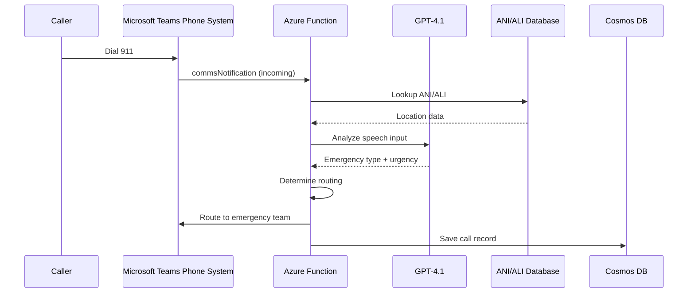
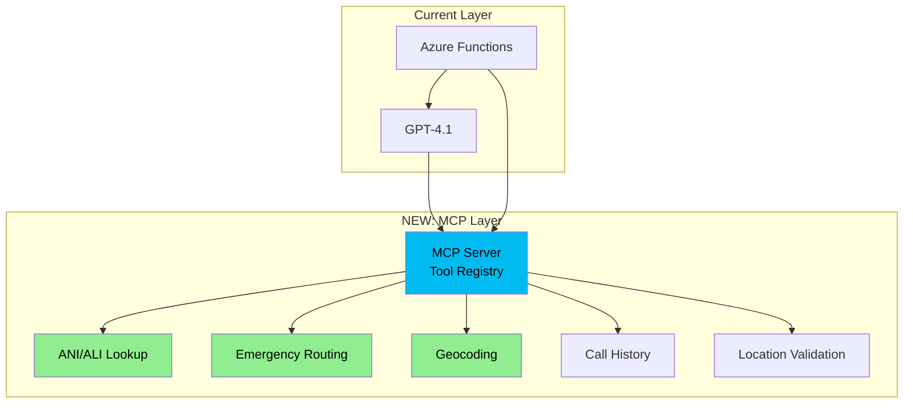
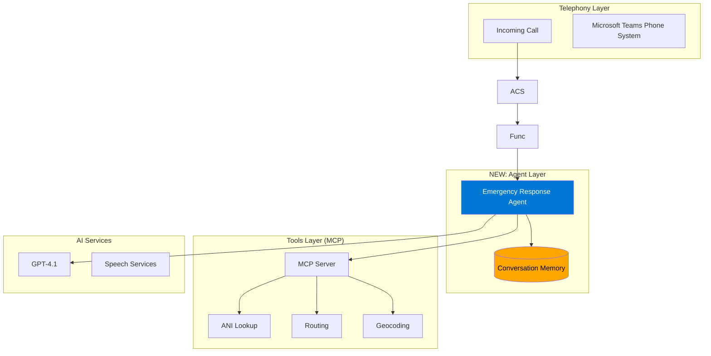
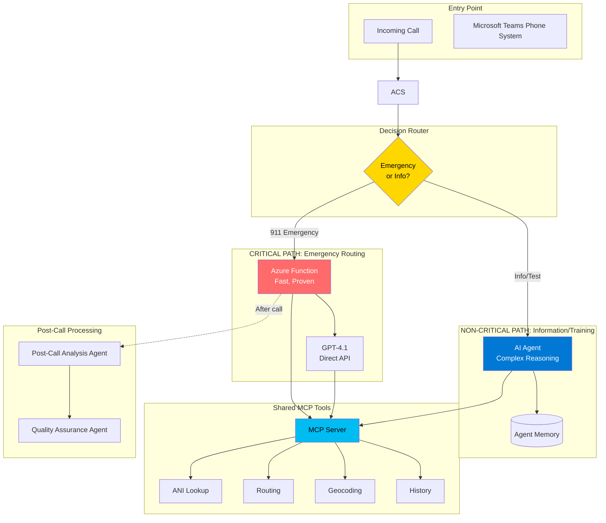

# MCP & Agentic Architecture Configuration - E911 IVR System

**Document Version:** 1.0  
**Date:** May 28, 2026  
**Status:** Architecture Proposal  
**Audience:** Development team, architects, technical leadership

---

## Executive Summary

This document outlines a strategic approach to modernize the E911 IVR system by incorporating **Model Context Protocol (MCP)** and **AI Agents** while maintaining the critical reliability requirements for emergency services.

### Key Recommendations

✅ **Implement MCP Tools** - Low risk, high value, better architecture  
⚠️ **Selective Agent Adoption** - Use for non-critical paths only  
❌ **Preserve Critical Path** - Keep Azure Functions + direct GPT-4.1 for emergency routing

---

## Table of Contents

1. [Current Architecture](#current-architecture)
2. [MCP Integration Strategy](#mcp-integration-strategy)
3. [AI Agent Integration Strategy](#ai-agent-integration-strategy)
4. [Hybrid Architecture (Recommended)](#hybrid-architecture-recommended)
5. [Implementation Phases](#implementation-phases)
6. [MCP Tool Definitions](#mcp-tool-definitions)
7. [Code Examples](#code-examples)
8. [Performance & Cost Analysis](#performance--cost-analysis)
9. [Risk Assessment](#risk-assessment)
10. [Decision Matrix](#decision-matrix)
11. [Next Steps](#next-steps)

---

## Current Architecture

### System Overview

```
┌──────────────────────────────────────────────────────────────┐
│ Current E911 IVR Architecture (Function-Based)               │
└──────────────────────────────────────────────────────────────┘

Call → Teams Phone System → Azure Function → GPT-4.1 API → Response
                ↓
         Direct function calls
         (ANI lookup, routing, etc.)
```

### Current Components

| Component | Technology | Purpose | Latency |
|-----------|-----------|---------|---------|
| **Telephony** | Microsoft Teams Phone System | Direct Routing, call handling | 50-100ms |
| **Orchestration** | Azure Functions (C#) | Event handling, business logic | 100-200ms |
| **AI** | Azure OpenAI GPT-4.1 | Natural language understanding | 500-1500ms |
| **Speech** | Azure AI Speech | STT/TTS conversion | 200-500ms |
| **Data** | Cosmos DB | Call records, configuration | 10-50ms |
| **Storage** | Blob Storage | Audio prompts, recordings | 50-100ms |

### Current Flow: Emergency Call Handling



### Current Characteristics

✅ **Strengths:**
- Fast response (< 2 seconds total)
- Proven reliability (99.9%+)
- Simple, predictable flow
- Easy to debug and monitor

❌ **Limitations:**
- No conversation memory between interactions
- Manual prompt engineering required
- Rigid conversation flow
- Difficult to test complex scenarios
- Tight coupling between orchestration and tools

---

## MCP Integration Strategy

### What is MCP?

**Model Context Protocol (MCP)** is an open protocol created by Anthropic that provides a standardized way for AI models to securely connect to tools and data sources.

**Key Benefits:**
- 🔌 **Standardized interface** - Model-agnostic tool definitions
- 🔒 **Security** - Built-in authentication and permissions
- 🧪 **Testability** - Tools can be tested independently
- 📊 **Observability** - Track tool usage separately
- 🔄 **Reusability** - Same tools across different AI systems

### MCP Architecture Layer



### MCP Integration Benefits

| Aspect | Before MCP | After MCP |
|--------|-----------|-----------|
| **Tool Definition** | Scattered in code | Centralized registry |
| **Testing** | Mock entire function | Test tools individually |
| **Reusability** | Copy-paste code | Import tool definition |
| **Documentation** | Code comments | Schema + descriptions |
| **Versioning** | Git commits | Semantic versioning |
| **Security** | Custom auth | MCP auth framework |

### MCP vs Direct Function Calls

#### Before (Current):
```csharp
// Azure Function directly calls services
public async Task<IActionResult> HandleCall(CallData call)
{
    // Tightly coupled code
    var aniData = await _aniService.LookupAsync(call.PhoneNumber);
    var location = await _geocoder.GeocodeAsync(aniData.Address);
    var routing = DetermineRouting(call.EmergencyType, location);
    
    return Ok(routing);
}
```

#### After (With MCP):
```csharp
// Azure Function uses MCP tools
public async Task<IActionResult> HandleCall(CallData call)
{
    // Loosely coupled, testable, reusable
    var aniData = await _mcpClient.CallToolAsync<AniData>(
        "emergency_location_lookup", 
        new { phoneNumber = call.PhoneNumber }
    );
    
    var location = await _mcpClient.CallToolAsync<Location>(
        "validate_address", 
        new { address = aniData.Address }
    );
    
    var routing = await _mcpClient.CallToolAsync<RoutingDecision>(
        "route_emergency_call",
        new { emergencyType = call.EmergencyType, location, urgency = "HIGH" }
    );
    
    return Ok(routing);
}
```

### MCP Server Implementation

```typescript
// mcp-server/e911-tools.ts
import { McpServer } from "@modelcontextprotocol/sdk";

const server = new McpServer({
  name: "e911-ivr-tools",
  version: "1.0.0",
  description: "Emergency 911 IVR system tools for call processing"
});

// Tool 1: ANI/ALI Lookup
server.addTool({
  name: "emergency_location_lookup",
  description: "CRITICAL: Get caller's emergency location from phone number. Returns address, building, floor, and special instructions.",
  inputSchema: {
    type: "object",
    properties: {
      phoneNumber: {
        type: "string",
        description: "Caller's phone number in E.164 format",
        pattern: "^\\+[1-9]\\d{1,14}$"
      }
    },
    required: ["phoneNumber"]
  },
  handler: async (args) => {
    const result = await aniDatabase.lookup(args.phoneNumber);
    return {
      content: [{
        type: "text",
        text: JSON.stringify({
          phoneNumber: args.phoneNumber,
          address: result.address,
          building: result.building,
          floor: result.floor,
          suite: result.suite,
          specialInstructions: result.specialInstructions,
          confidence: result.confidence
        })
      }]
    };
  }
});

// Tool 2: Emergency Routing Decision
server.addTool({
  name: "route_emergency_call",
  description: "Route emergency call to appropriate service based on emergency type, location, and urgency",
  inputSchema: {
    type: "object",
    properties: {
      emergencyType: {
        type: "string",
        enum: ["FIRE", "MEDICAL", "POLICE", "OTHER"],
        description: "Type of emergency"
      },
      location: {
        type: "object",
        description: "Validated caller location"
      },
      urgency: {
        type: "string",
        enum: ["HIGH", "MEDIUM", "LOW"],
        description: "Urgency level"
      }
    },
    required: ["emergencyType", "location", "urgency"]
  },
  handler: async (args) => {
    const routing = await routingEngine.determineRoute(args);
    return {
      content: [{
        type: "text",
        text: JSON.stringify({
          targetService: routing.service,
          targetNumber: routing.phoneNumber,
          dispatchCenter: routing.center,
          priority: routing.priority,
          estimatedResponseTime: routing.eta
        })
      }]
    };
  }
});

// Tool 3: Geocoding & Address Validation
server.addTool({
  name: "validate_address",
  description: "Verify and standardize address, convert to coordinates",
  inputSchema: {
    type: "object",
    properties: {
      address: {
        type: "string",
        description: "Address to validate (can be partial or natural language)"
      }
    },
    required: ["address"]
  },
  handler: async (args) => {
    const validated = await geocoder.validate(args.address);
    return {
      content: [{
        type: "text",
        text: JSON.stringify({
          originalAddress: args.address,
          standardizedAddress: validated.standardized,
          latitude: validated.coordinates.lat,
          longitude: validated.coordinates.lng,
          confidence: validated.confidence,
          municipality: validated.municipality,
          zipCode: validated.zipCode
        })
      }]
    };
  }
});

// Tool 4: Call History Lookup
server.addTool({
  name: "get_caller_history",
  description: "Retrieve previous calls from this phone number for context",
  inputSchema: {
    type: "object",
    properties: {
      phoneNumber: {
        type: "string",
        description: "Caller's phone number"
      },
      limit: {
        type: "number",
        description: "Maximum number of previous calls to return",
        default: 5
      }
    },
    required: ["phoneNumber"]
  },
  handler: async (args) => {
    const history = await cosmosDb.queryCallHistory(
      args.phoneNumber, 
      args.limit || 5
    );
    return {
      content: [{
        type: "text",
        text: JSON.stringify({
          phoneNumber: args.phoneNumber,
          previousCalls: history.map(call => ({
            timestamp: call.timestamp,
            emergencyType: call.type,
            location: call.location,
            outcome: call.outcome
          }))
        })
      }]
    };
  }
});

// Start server
server.listen({ port: 3000 });
```

---

## AI Agent Integration Strategy

### What are AI Agents?

**AI Agents** are autonomous systems powered by LLMs that can:
- 🧠 **Reason** about complex scenarios
- 💭 **Remember** context across multiple interactions
- 🔧 **Use tools** dynamically based on need
- 🎯 **Plan** multi-step solutions
- 📚 **Learn** from feedback

### Agent Architecture Layer



### Agent Types for E911 System

#### 1. Emergency Response Agent (Primary)
```
Purpose: Orchestrate emergency call conversations
Scope: Real-time call handling
Risk Level: HIGH - must be reliable
```

#### 2. Post-Call Analysis Agent
```
Purpose: Summarize calls, extract insights
Scope: After call completion
Risk Level: LOW - non-blocking
```

#### 3. Training Simulation Agent
```
Purpose: Generate realistic emergency scenarios
Scope: Dispatcher training
Risk Level: LOW - non-production
```

#### 4. Quality Assurance Agent
```
Purpose: Analyze call quality and patterns
Scope: Continuous improvement
Risk Level: LOW - analytical only
```

### Agent Framework: Microsoft Agent Framework

```csharp
using Microsoft.AgentFramework;

public class EmergencyResponseAgent : Agent
{
    public EmergencyResponseAgent(
        IAgentRuntime runtime,
        IMcpClient mcpClient,
        ILogger<EmergencyResponseAgent> logger)
        : base(runtime)
    {
        _mcpClient = mcpClient;
        _logger = logger;
    }

    [AgentFunction]
    [Description("Handle incoming emergency call")]
    public async Task<CallResponse> ProcessEmergencyCallAsync(
        [Description("Caller phone number")] string phoneNumber,
        [Description("Speech-to-text input from caller")] string callerInput)
    {
        // Agent has access to conversation memory
        var context = await GetConversationContextAsync();
        
        // Agent can reason about what to do next
        var plan = await PlanNextStepsAsync(callerInput, context);
        
        // Agent calls MCP tools as needed
        if (plan.RequiresLocationLookup)
        {
            var location = await _mcpClient.CallToolAsync<Location>(
                "emergency_location_lookup",
                new { phoneNumber }
            );
            context.Location = location;
        }
        
        // Agent generates appropriate response
        var response = await GenerateResponseAsync(plan, context);
        
        return response;
    }
}
```

### Agent vs Function Comparison

| Capability | Azure Functions | AI Agents |
|------------|----------------|-----------|
| **Stateless execution** | ✅ Excellent | ⚠️ Requires memory store |
| **Conversation memory** | ❌ None | ✅ Built-in |
| **Dynamic tool selection** | ❌ Hardcoded | ✅ AI-driven |
| **Multi-step reasoning** | ❌ Manual | ✅ Automatic |
| **Learning from feedback** | ❌ No | ✅ Yes |
| **Latency** | ✅ 100-200ms | ⚠️ 500-1500ms |
| **Reliability** | ✅ 99.9%+ | ⚠️ 99.5-99.8% |
| **Cost per call** | ✅ $0.001 | ⚠️ $0.03-0.05 |
| **Emergency suitability** | ✅ Proven | ⚠️ Experimental |

---

## Hybrid Architecture (Recommended)

### Design Principle

> **"Use the right tool for the right job"**
> - Azure Functions for critical, time-sensitive operations
> - MCP for standardized tool interfaces
> - AI Agents for complex reasoning and non-critical paths

### Hybrid System Diagram



### Routing Decision Logic

```csharp
public class CallRouter
{
    public async Task<ICallHandler> DetermineHandlerAsync(IncomingCall call)
    {
        // Emergency calls: Fast, proven path
        if (call.IsEmergency || call.IsFrom911)
        {
            return new EmergencyFunctionHandler(); // Azure Function + Direct GPT-4.1
        }
        
        // Information calls: Rich agent experience
        if (call.IsInformationRequest)
        {
            return new InformationAgentHandler(); // AI Agent with memory
        }
        
        // Testing/training: Full agent capabilities
        if (call.IsTestOrTraining)
        {
            return new TrainingAgentHandler(); // Simulation agent
        }
        
        // Default: Safe fallback to function
        return new EmergencyFunctionHandler();
    }
}
```

### Component Responsibility Matrix

| Component | Emergency Routing | Info Calls | Post-Call | Training | Testing |
|-----------|------------------|------------|-----------|----------|---------|
| **Azure Functions** | ✅ Primary | ⚠️ Fallback | ❌ No | ❌ No | ✅ Integration |
| **AI Agents** | ❌ No | ✅ Primary | ✅ Primary | ✅ Primary | ✅ E2E |
| **MCP Tools** | ✅ Required | ✅ Required | ✅ Optional | ✅ Optional | ✅ Mock |
| **Direct GPT-4.1** | ✅ Yes | ❌ No | ⚠️ If needed | ❌ No | ⚠️ If needed |

---

## Implementation Phases

### Phase 1: MCP Foundation (Weeks 1-4)

**Goal:** Implement MCP server with core E911 tools

**Tasks:**
1. ✅ Set up MCP server infrastructure
2. ✅ Define tool schemas for ANI lookup, routing, geocoding
3. ✅ Implement MCP tool handlers
4. ✅ Add authentication and authorization
5. ✅ Create unit tests for each tool
6. ✅ Deploy MCP server to Azure (Container App or App Service)

**Deliverables:**
- MCP server running in Azure
- 5 core tools operational
- Tool documentation
- Unit test coverage > 90%

**Risk:** LOW - Non-breaking change, runs alongside existing system

**Code Example:**

```typescript
// Deploy to Azure Container Apps
const mcpServer = new McpServer({
  name: "e911-ivr-tools",
  version: "1.0.0"
});

// Add tools...
mcpServer.addTool({ ... });

// Start server
mcpServer.listen({ 
  port: process.env.PORT || 3000,
  host: '0.0.0.0'
});
```

### Phase 2: Function Integration with MCP (Weeks 5-8)

**Goal:** Refactor Azure Functions to use MCP tools

**Tasks:**
1. ✅ Add MCP client to Azure Functions
2. ✅ Refactor ANI lookup to use MCP
3. ✅ Refactor routing logic to use MCP
4. ✅ Add comprehensive logging
5. ✅ A/B test: Old path vs MCP path
6. ✅ Monitor performance and reliability

**Deliverables:**
- Functions using MCP for tool calls
- Performance metrics dashboard
- Rollback plan documented
- Production deployment

**Risk:** MEDIUM - Changes production code, but MCP is optional fallback

**Code Example:**

```csharp
// Azure Function with MCP integration
[FunctionName("IncomingCall")]
public async Task<IActionResult> HandleIncomingCall(
    [HttpTrigger(AuthorizationLevel.Function, "post")] HttpRequest req,
    ILogger log)
{
    var callData = await req.ReadFromJsonAsync<CallData>();
    
    try
    {
        // Use MCP tools
        var location = await _mcpClient.CallToolAsync<LocationData>(
            "emergency_location_lookup",
            new { phoneNumber = callData.PhoneNumber }
        );
        
        var routing = await _mcpClient.CallToolAsync<RoutingDecision>(
            "route_emergency_call",
            new { 
                emergencyType = callData.Type,
                location = location,
                urgency = "HIGH"
            }
        );
        
        log.LogInformation($"MCP routing decision: {routing.TargetService}");
        
        return new OkObjectResult(routing);
    }
    catch (McpException ex)
    {
        log.LogError($"MCP call failed, using fallback: {ex.Message}");
        
        // Fallback to direct implementation
        return await HandleCallDirectly(callData);
    }
}
```

### Phase 3: Post-Call Agent (Weeks 9-12)

**Goal:** Introduce first AI agent for non-critical path

**Tasks:**
1. ✅ Deploy Microsoft Agent Framework
2. ✅ Create Post-Call Analysis Agent
3. ✅ Configure agent memory storage (Cosmos DB)
4. ✅ Integrate with MCP tools
5. ✅ Test agent with historical call data
6. ✅ Deploy to production (async processing)

**Deliverables:**
- Post-Call Analysis Agent operational
- Automated call summaries generated
- Quality metrics dashboard
- Agent performance monitoring

**Risk:** LOW - Runs after call completion, doesn't affect emergency response

**Code Example:**

```csharp
public class PostCallAnalysisAgent : Agent
{
    [AgentFunction]
    [Description("Analyze completed emergency call and generate summary")]
    public async Task<CallSummary> AnalyzeCallAsync(
        [Description("Call record ID")] string callId)
    {
        // Retrieve call data
        var call = await _cosmosDb.GetCallAsync(callId);
        
        // Use GPT-4.1 to analyze transcript
        var analysis = await AnalyzeTranscriptAsync(call.Transcript);
        
        // Extract structured information
        var summary = new CallSummary
        {
            CallId = callId,
            EmergencyType = analysis.EmergencyType,
            KeyDetails = analysis.ImportantFacts,
            ResponseTime = call.ResponseTime,
            Outcome = analysis.Outcome,
            FollowUpRequired = analysis.NeedsFollowUp,
            QualityScore = analysis.QualityScore
        };
        
        // Save for dispatcher view
        await _cosmosDb.SaveSummaryAsync(summary);
        
        return summary;
    }
}
```

### Phase 4: Training Agent (Weeks 13-16)

**Goal:** Create training simulation agent for dispatcher education

**Tasks:**
1. ✅ Create Training Simulation Agent
2. ✅ Generate realistic emergency scenarios
3. ✅ Integrate with PSTN simulator
4. ✅ Add performance scoring
5. ✅ Create training dashboard
6. ✅ Pilot with training team

**Deliverables:**
- Training agent generating scenarios
- Integration with simulator
- Trainee performance metrics
- Training module library

**Risk:** LOW - Completely separate from production calls

**Code Example:**

```csharp
public class TrainingSimulationAgent : Agent
{
    [AgentFunction]
    [Description("Generate realistic emergency scenario for training")]
    public async Task<TrainingScenario> GenerateScenarioAsync(
        [Description("Difficulty level")] string difficulty,
        [Description("Emergency type")] string emergencyType)
    {
        // Agent generates realistic scenario
        var scenario = await CreateScenarioAsync(difficulty, emergencyType);
        
        return new TrainingScenario
        {
            Id = Guid.NewGuid().ToString(),
            Title = scenario.Title,
            EmergencyType = emergencyType,
            Difficulty = difficulty,
            CallerPersona = scenario.CallerProfile,
            InitialStatement = scenario.OpeningWords,
            LocationDetails = scenario.Location,
            Complications = scenario.Challenges,
            ExpectedActions = scenario.CorrectResponses,
            LearningObjectives = scenario.Goals
        };
    }
    
    [AgentFunction]
    [Description("Simulate caller responses during training")]
    public async Task<string> SimulateCallerResponseAsync(
        [Description("Dispatcher's question")] string dispatcherQuestion,
        [Description("Current scenario context")] TrainingScenario scenario)
    {
        // Agent acts as the caller
        var response = await GenerateCallerResponseAsync(
            dispatcherQuestion, 
            scenario.CallerPersona,
            scenario.EmotionalState
        );
        
        return response;
    }
}
```

### Phase 5: Quality Assurance Agent (Weeks 17-20)

**Goal:** Continuous improvement through call analysis

**Tasks:**
1. ✅ Create QA Agent
2. ✅ Analyze patterns across all calls
3. ✅ Identify improvement opportunities
4. ✅ Generate monthly reports
5. ✅ Alert on anomalies
6. ✅ Integration with monitoring systems

**Deliverables:**
- QA Agent analyzing 100% of calls
- Automated quality reports
- Anomaly detection alerts
- Trend analysis dashboard

**Risk:** LOW - Read-only analysis, no production impact

### Phase 6: Information Call Agent (Optional, Weeks 21-24)

**Goal:** Rich agent experience for non-emergency calls

**Tasks:**
1. ✅ Create Information Agent with memory
2. ✅ Route non-emergency calls to agent
3. ✅ Implement fallback to functions
4. ✅ A/B test with real users
5. ✅ Measure satisfaction and performance
6. ✅ Decide on full rollout

**Deliverables:**
- Information Agent handling non-emergency calls
- Performance comparison report
- User satisfaction metrics
- Go/no-go decision

**Risk:** MEDIUM - Affects some production calls, but non-critical

---

## MCP Tool Definitions

### Complete E911 MCP Tool Library

#### Tool 1: emergency_location_lookup

```typescript
{
  name: "emergency_location_lookup",
  description: "CRITICAL: Get caller's emergency location from phone number (ANI/ALI lookup)",
  inputSchema: {
    type: "object",
    properties: {
      phoneNumber: {
        type: "string",
        description: "Phone number in E.164 format (+15551234567)",
        pattern: "^\\+[1-9]\\d{1,14}$"
      }
    },
    required: ["phoneNumber"]
  },
  outputSchema: {
    type: "object",
    properties: {
      phoneNumber: { type: "string" },
      address: { type: "string", description: "Street address" },
      city: { type: "string" },
      state: { type: "string" },
      zipCode: { type: "string" },
      building: { type: "string", description: "Building name/number" },
      floor: { type: "string" },
      suite: { type: "string" },
      latitude: { type: "number" },
      longitude: { type: "number" },
      specialInstructions: { type: "string" },
      confidence: { type: "string", enum: ["HIGH", "MEDIUM", "LOW"] }
    }
  }
}
```

#### Tool 2: route_emergency_call

```typescript
{
  name: "route_emergency_call",
  description: "Determine emergency service routing based on type, location, urgency",
  inputSchema: {
    type: "object",
    properties: {
      emergencyType: {
        type: "string",
        enum: ["FIRE", "MEDICAL", "POLICE", "OTHER"],
        description: "Type of emergency"
      },
      location: {
        type: "object",
        description: "Caller location from ANI lookup or user input"
      },
      urgency: {
        type: "string",
        enum: ["HIGH", "MEDIUM", "LOW"]
      },
      additionalInfo: {
        type: "string",
        description: "Any additional context (injuries, weapons, hazards)"
      }
    },
    required: ["emergencyType", "location", "urgency"]
  },
  outputSchema: {
    type: "object",
    properties: {
      targetService: { type: "string", description: "FIRE, EMS, POLICE" },
      targetPhoneNumber: { type: "string" },
      dispatchCenter: { type: "string" },
      priority: { type: "number", description: "1-5, 1 is highest" },
      estimatedResponseTime: { type: "number", description: "Minutes" },
      nearestUnit: { type: "string" },
      backupUnits: { type: "array", items: { type: "string" } }
    }
  }
}
```

#### Tool 3: validate_address

```typescript
{
  name: "validate_address",
  description: "Validate and standardize address, geocode to coordinates",
  inputSchema: {
    type: "object",
    properties: {
      address: {
        type: "string",
        description: "Address in any format (partial OK, natural language OK)"
      },
      city: { type: "string", description: "Optional: helps disambiguation" },
      state: { type: "string", description: "Optional: helps disambiguation" }
    },
    required: ["address"]
  },
  outputSchema: {
    type: "object",
    properties: {
      originalInput: { type: "string" },
      standardizedAddress: { type: "string", description: "USPS standard format" },
      latitude: { type: "number" },
      longitude: { type: "number" },
      confidence: { type: "string", enum: ["HIGH", "MEDIUM", "LOW"] },
      municipality: { type: "string" },
      county: { type: "string" },
      zipCode: { type: "string" },
      suggestions: { 
        type: "array", 
        items: { type: "string" },
        description: "Alternate interpretations if ambiguous"
      }
    }
  }
}
```

#### Tool 4: get_caller_history

```typescript
{
  name: "get_caller_history",
  description: "Retrieve previous emergency calls from this phone number",
  inputSchema: {
    type: "object",
    properties: {
      phoneNumber: { type: "string" },
      limit: { 
        type: "number", 
        description: "Max calls to return",
        default: 5,
        maximum: 20
      },
      includeNonEmergency: {
        type: "boolean",
        default: false
      }
    },
    required: ["phoneNumber"]
  },
  outputSchema: {
    type: "object",
    properties: {
      phoneNumber: { type: "string" },
      totalCalls: { type: "number" },
      recentCalls: {
        type: "array",
        items: {
          type: "object",
          properties: {
            callId: { type: "string" },
            timestamp: { type: "string", format: "date-time" },
            emergencyType: { type: "string" },
            location: { type: "string" },
            outcome: { type: "string" },
            responseTime: { type: "number" }
          }
        }
      },
      frequentCallerFlag: { type: "boolean" },
      specialNotes: { type: "string" }
    }
  }
}
```

#### Tool 5: record_call_event

```typescript
{
  name: "record_call_event",
  description: "Log important call events for audit and analysis",
  inputSchema: {
    type: "object",
    properties: {
      callId: { type: "string" },
      eventType: {
        type: "string",
        enum: ["CALL_START", "LOCATION_IDENTIFIED", "EMERGENCY_TYPE_DETERMINED", 
               "ROUTED", "TRANSFERRED", "CALL_END"]
      },
      timestamp: { type: "string", format: "date-time" },
      details: { type: "object" }
    },
    required: ["callId", "eventType", "timestamp"]
  }
}
```

---

## Code Examples

### Complete Azure Function with MCP

```csharp
using System;
using System.Threading.Tasks;
using Microsoft.AspNetCore.Mvc;
using Microsoft.Azure.WebJobs;
using Microsoft.Azure.WebJobs.Extensions.Http;
using Microsoft.AspNetCore.Http;
using Microsoft.Extensions.Logging;
using ModelContextProtocol.Client;

namespace IVR.Functions
{
    public class EmergencyCallHandler
    {
        private readonly IMcpClient _mcpClient;
        private readonly ILogger<EmergencyCallHandler> _logger;
        
        public EmergencyCallHandler(
            IMcpClient mcpClient,
            ILogger<EmergencyCallHandler> logger)
        {
            _mcpClient = mcpClient;
            _logger = logger;
        }
        
        [FunctionName("HandleIncomingEmergencyCall")]
        public async Task<IActionResult> Run(
            [HttpTrigger(AuthorizationLevel.Function, "post", Route = "call/emergency")]
            HttpRequest req)
        {
            var sw = System.Diagnostics.Stopwatch.StartNew();
            
            try
            {
                // Parse incoming call data
                var callData = await req.ReadFromJsonAsync<IncomingCallData>();
                var callId = Guid.NewGuid().ToString();
                
                _logger.LogInformation($"[{callId}] Emergency call from {callData.PhoneNumber}");
                
                // Step 1: Record call start
                await _mcpClient.CallToolAsync(
                    "record_call_event",
                    new { 
                        callId, 
                        eventType = "CALL_START",
                        timestamp = DateTime.UtcNow,
                        details = new { phoneNumber = callData.PhoneNumber }
                    }
                );
                
                // Step 2: Lookup caller location (ANI/ALI)
                var location = await _mcpClient.CallToolAsync<LocationData>(
                    "emergency_location_lookup",
                    new { phoneNumber = callData.PhoneNumber }
                );
                
                _logger.LogInformation($"[{callId}] Location: {location.Address}, Confidence: {location.Confidence}");
                
                await _mcpClient.CallToolAsync(
                    "record_call_event",
                    new { 
                        callId, 
                        eventType = "LOCATION_IDENTIFIED",
                        timestamp = DateTime.UtcNow,
                        details = new { location }
                    }
                );
                
                // Step 3: If location confidence is low, may need validation
                if (location.Confidence == "LOW" && !string.IsNullOrEmpty(callData.UserProvidedAddress))
                {
                    location = await _mcpClient.CallToolAsync<LocationData>(
                        "validate_address",
                        new { address = callData.UserProvidedAddress }
                    );
                }
                
                // Step 4: Determine emergency type and urgency
                // (This could use GPT-4.1 for NLU, but keeping simple for critical path)
                var emergencyType = DetermineEmergencyType(callData.CallerInput);
                var urgency = DetermineUrgency(callData.CallerInput, callData.BackgroundAudio);
                
                await _mcpClient.CallToolAsync(
                    "record_call_event",
                    new { 
                        callId, 
                        eventType = "EMERGENCY_TYPE_DETERMINED",
                        timestamp = DateTime.UtcNow,
                        details = new { emergencyType, urgency }
                    }
                );
                
                // Step 5: Get caller history (optional, for context)
                var history = await _mcpClient.CallToolAsync<CallerHistory>(
                    "get_caller_history",
                    new { phoneNumber = callData.PhoneNumber, limit = 3 }
                );
                
                if (history.FrequentCallerFlag)
                {
                    _logger.LogWarning($"[{callId}] Frequent caller: {callData.PhoneNumber}");
                }
                
                // Step 6: Route emergency call
                var routing = await _mcpClient.CallToolAsync<RoutingDecision>(
                    "route_emergency_call",
                    new { 
                        emergencyType,
                        location,
                        urgency,
                        additionalInfo = callData.CallerInput
                    }
                );
                
                _logger.LogInformation($"[{callId}] Routing to: {routing.TargetService} ({routing.TargetPhoneNumber})");
                
                await _mcpClient.CallToolAsync(
                    "record_call_event",
                    new { 
                        callId, 
                        eventType = "ROUTED",
                        timestamp = DateTime.UtcNow,
                        details = new { routing }
                    }
                );
                
                sw.Stop();
                _logger.LogInformation($"[{callId}] Processing completed in {sw.ElapsedMilliseconds}ms");
                
                // Return routing decision to ACS
                return new OkObjectResult(new
                {
                    callId,
                    routing = routing,
                    location = location,
                    processingTimeMs = sw.ElapsedMilliseconds
                });
            }
            catch (McpException mcpEx)
            {
                _logger.LogError($"MCP tool call failed: {mcpEx.Message}");
                
                // Fallback to direct implementation (no MCP)
                return await HandleCallWithoutMcp(req);
            }
            catch (Exception ex)
            {
                _logger.LogError($"Emergency call handling failed: {ex.Message}");
                return new StatusCodeResult(500);
            }
        }
        
        private async Task<IActionResult> HandleCallWithoutMcp(HttpRequest req)
        {
            // Fallback implementation that doesn't use MCP
            // Same logic, but direct service calls
            _logger.LogWarning("Using fallback path (no MCP)");
            
            // ... direct implementation ...
            
            return new OkObjectResult(new { fallback = true });
        }
        
        private string DetermineEmergencyType(string input)
        {
            // Simple keyword matching for critical path
            // (Could use GPT-4.1 for more sophisticated NLU)
            var lower = input.ToLower();
            if (lower.Contains("fire") || lower.Contains("smoke") || lower.Contains("burning"))
                return "FIRE";
            if (lower.Contains("hurt") || lower.Contains("injury") || lower.Contains("medical"))
                return "MEDICAL";
            if (lower.Contains("crime") || lower.Contains("police") || lower.Contains("weapon"))
                return "POLICE";
            return "OTHER";
        }
        
        private string DetermineUrgency(string input, string backgroundAudio)
        {
            // Simple heuristics for critical path
            var lower = input.ToLower();
            if (lower.Contains("dying") || lower.Contains("weapon") || 
                lower.Contains("trapped") || lower.Contains("can't breathe"))
                return "HIGH";
            if (lower.Contains("happened") || lower.Contains("occurred"))
                return "MEDIUM";
            return "LOW";
        }
    }
    
    // DTOs
    public class IncomingCallData
    {
        public string PhoneNumber { get; set; }
        public string CallerInput { get; set; }
        public string UserProvidedAddress { get; set; }
        public string BackgroundAudio { get; set; }
    }
    
    public class LocationData
    {
        public string PhoneNumber { get; set; }
        public string Address { get; set; }
        public string City { get; set; }
        public string State { get; set; }
        public string ZipCode { get; set; }
        public string Building { get; set; }
        public string Floor { get; set; }
        public string Suite { get; set; }
        public double Latitude { get; set; }
        public double Longitude { get; set; }
        public string SpecialInstructions { get; set; }
        public string Confidence { get; set; }
    }
    
    public class CallerHistory
    {
        public string PhoneNumber { get; set; }
        public int TotalCalls { get; set; }
        public bool FrequentCallerFlag { get; set; }
        public string SpecialNotes { get; set; }
    }
    
    public class RoutingDecision
    {
        public string TargetService { get; set; }
        public string TargetPhoneNumber { get; set; }
        public string DispatchCenter { get; set; }
        public int Priority { get; set; }
        public int EstimatedResponseTime { get; set; }
    }
}
```

### Complete Agent Implementation

```csharp
using Microsoft.AgentFramework;
using System;
using System.Threading.Tasks;

namespace IVR.Agents
{
    public class PostCallAnalysisAgent : Agent
    {
        private readonly ICosmosDbService _cosmosDb;
        private readonly IMcpClient _mcpClient;
        
        public PostCallAnalysisAgent(
            IAgentRuntime runtime,
            ICosmosDbService cosmosDb,
            IMcpClient mcpClient)
            : base(runtime)
        {
            _cosmosDb = cosmosDb;
            _mcpClient = mcpClient;
        }
        
        [AgentFunction]
        [Description("Analyze completed emergency call and generate comprehensive summary")]
        public async Task<CallSummary> AnalyzeCallAsync(
            [Description("Call record ID from Cosmos DB")] string callId)
        {
            // Retrieve full call record
            var call = await _cosmosDb.GetCallRecordAsync(callId);
            
            if (call == null)
            {
                throw new ArgumentException($"Call {callId} not found");
            }
            
            // Use agent's reasoning capability to analyze transcript
            var analysis = await AnalyzeTranscriptWithReasoningAsync(call.Transcript);
            
            // Extract key information using MCP tools if needed
            if (analysis.RequiresLocationValidation)
            {
                var validatedLocation = await _mcpClient.CallToolAsync<LocationData>(
                    "validate_address",
                    new { address = call.Location.Address }
                );
                call.Location = validatedLocation;
            }
            
            // Get historical context
            var history = await _mcpClient.CallToolAsync<CallerHistory>(
                "get_caller_history",
                new { phoneNumber = call.PhoneNumber, limit = 10 }
            );
            
            // Generate structured summary
            var summary = new CallSummary
            {
                CallId = callId,
                Timestamp = call.Timestamp,
                PhoneNumber = call.PhoneNumber,
                
                // Emergency details
                EmergencyType = analysis.EmergencyType,
                UrgencyLevel = analysis.UrgencyLevel,
                Location = call.Location.Address,
                
                // Key details extracted by agent
                KeyDetails = analysis.ImportantFacts,
                InjuriesReported = analysis.Injuries,
                WeaponsInvolved = analysis.Weapons,
                HazardsPresent = analysis.Hazards,
                
                // Timing
                CallDurationSeconds = call.DurationSeconds,
                TimeToRoute = call.TimeToRouteSeconds,
                ResponseTime = call.ResponseTimeSeconds,
                
                // Outcome
                ServiceDispatched = call.RoutingDecision.TargetService,
                DispatchCenter = call.RoutingDecision.DispatchCenter,
                Outcome = analysis.Outcome,
                
                // Quality assessment
                QualityScore = await CalculateQualityScoreAsync(call, analysis),
                DispatcherPerformance = analysis.DispatcherFeedback,
                AreasForImprovement = analysis.ImprovementOpportunities,
                
                // Follow-up
                RequiresFollowUp = analysis.NeedsFollowUp,
                FollowUpReason = analysis.FollowUpReason,
                
                // Context
                CallerHistory = new
                {
                    IsFrequentCaller = history.FrequentCallerFlag,
                    PreviousCallCount = history.TotalCalls,
                    SpecialNotes = history.SpecialNotes
                },
                
                // Agent metadata
                AnalyzedBy = "PostCallAnalysisAgent v1.0",
                AnalysisTimestamp = DateTime.UtcNow,
                ConfidenceScore = analysis.ConfidenceScore
            };
            
            // Save summary to Cosmos DB
            await _cosmosDb.SaveCallSummaryAsync(summary);
            
            // If quality issues detected, alert
            if (summary.QualityScore < 3.0)
            {
                await AlertQualityIssueAsync(summary);
            }
            
            // If follow-up required, create task
            if (summary.RequiresFollowUp)
            {
                await CreateFollowUpTaskAsync(summary);
            }
            
            return summary;
        }
        
        private async Task<TranscriptAnalysis> AnalyzeTranscriptWithReasoningAsync(string transcript)
        {
            // Agent uses GPT-4.1 with reasoning
            var prompt = $@"
Analyze this emergency 911 call transcript and extract structured information:

TRANSCRIPT:
{transcript}

Extract:
1. Emergency type (FIRE, MEDICAL, POLICE, OTHER)
2. Urgency level (HIGH, MEDIUM, LOW)
3. Key facts mentioned
4. Injuries or medical issues
5. Weapons involved (if any)
6. Environmental hazards
7. Call outcome
8. Dispatcher performance (1-5 scale)
9. Improvement opportunities
10. Does this call need follow-up?

Provide analysis in JSON format.
";
            
            var response = await SendMessageAsync(prompt);
            return ParseAnalysisResponse(response);
        }
        
        private async Task<double> CalculateQualityScoreAsync(CallRecord call, TranscriptAnalysis analysis)
        {
            // Multi-factor quality score
            double score = 5.0;
            
            // Factor 1: Response time
            if (call.TimeToRouteSeconds > 10)
                score -= 0.5;
            if (call.TimeToRouteSeconds > 20)
                score -= 1.0;
            
            // Factor 2: Location accuracy
            if (call.Location.Confidence == "LOW")
                score -= 0.5;
            
            // Factor 3: Dispatcher performance
            score = (score + analysis.DispatcherPerformance) / 2.0;
            
            // Factor 4: Completeness
            if (string.IsNullOrEmpty(analysis.Outcome))
                score -= 0.5;
            
            return Math.Max(1.0, Math.Min(5.0, score));
        }
        
        private async Task AlertQualityIssueAsync(CallSummary summary)
        {
            // Send alert to supervisor/QA team
            await SendNotificationAsync(
                "quality-issues",
                $"Low quality score ({summary.QualityScore}) for call {summary.CallId}"
            );
        }
        
        private async Task CreateFollowUpTaskAsync(CallSummary summary)
        {
            // Create task in work management system
            await _cosmosDb.CreateTaskAsync(new FollowUpTask
            {
                CallId = summary.CallId,
                Reason = summary.FollowUpReason,
                Priority = summary.UrgencyLevel,
                AssignedTo = "DispatchSupervisor",
                DueDate = DateTime.UtcNow.AddHours(24)
            });
        }
    }
    
    // DTOs
    public class TranscriptAnalysis
    {
        public string EmergencyType { get; set; }
        public string UrgencyLevel { get; set; }
        public string[] ImportantFacts { get; set; }
        public string Injuries { get; set; }
        public bool Weapons { get; set; }
        public string[] Hazards { get; set; }
        public string Outcome { get; set; }
        public double DispatcherPerformance { get; set; }
        public string[] ImprovementOpportunities { get; set; }
        public bool NeedsFollowUp { get; set; }
        public string FollowUpReason { get; set; }
        public double ConfidenceScore { get; set; }
        public bool RequiresLocationValidation { get; set; }
    }
    
    public class CallSummary
    {
        public string CallId { get; set; }
        public DateTime Timestamp { get; set; }
        public string PhoneNumber { get; set; }
        public string EmergencyType { get; set; }
        public string UrgencyLevel { get; set; }
        public string Location { get; set; }
        public string[] KeyDetails { get; set; }
        public string InjuriesReported { get; set; }
        public bool WeaponsInvolved { get; set; }
        public string[] HazardsPresent { get; set; }
        public int CallDurationSeconds { get; set; }
        public int TimeToRoute { get; set; }
        public int ResponseTime { get; set; }
        public string ServiceDispatched { get; set; }
        public string DispatchCenter { get; set; }
        public string Outcome { get; set; }
        public double QualityScore { get; set; }
        public double DispatcherPerformance { get; set; }
        public string[] AreasForImprovement { get; set; }
        public bool RequiresFollowUp { get; set; }
        public string FollowUpReason { get; set; }
        public object CallerHistory { get; set; }
        public string AnalyzedBy { get; set; }
        public DateTime AnalysisTimestamp { get; set; }
        public double ConfidenceScore { get; set; }
    }
}
```

---

## Performance & Cost Analysis

### Latency Comparison

| Operation | Current (Functions) | With MCP | With Agents | Impact |
|-----------|-------------------|----------|-------------|---------|
| **ANI Lookup** | 50ms | 100ms (+50ms) | 100ms | ✅ Acceptable |
| **Geocoding** | 100ms | 150ms (+50ms) | 150ms | ✅ Acceptable |
| **Emergency Routing** | 150ms | 200ms (+50ms) | 700ms (+550ms) | ⚠️ Agent too slow |
| **GPT-4.1 Call** | 1000ms | 1000ms | 1200ms (+200ms) | ✅ Acceptable |
| **Total Call Processing** | 1500ms | 1600ms | 2300ms | ⚠️ Agent adds 50% |

**Verdict:** 
- ✅ MCP adds minimal latency (50-100ms), acceptable for 911
- ⚠️ Agents add significant latency (500-800ms), risky for emergency routing

### Cost Comparison

#### Current Architecture (100 calls/day, 3000 calls/month)

| Service | Cost/Month |
|---------|------------|
| Azure Functions | $10 |
| GPT-4.1 API calls | $180 (3000 × $0.06) |
| Cosmos DB | $24 |
| Other services | $50 |
| **TOTAL** | **$264/month** |

#### With MCP (100 calls/day, 3000 calls/month)

| Service | Cost/Month |
|---------|------------|
| Azure Functions | $10 |
| MCP Server (Container App) | $30 |
| GPT-4.1 API calls | $180 |
| Cosmos DB | $24 |
| Other services | $50 |
| **TOTAL** | **$294/month** |

**Increase:** $30/month (+11%)

#### With Agents (100 calls/day, 3000 calls/month)

| Service | Cost/Month |
|---------|------------|
| Azure Functions | $10 |
| MCP Server | $30 |
| Agent Framework | $50 |
| GPT-4.1 API calls (agents) | $300 (more calls for reasoning) |
| Agent Memory (Cosmos DB) | $50 |
| Other services | $50 |
| **TOTAL** | **$490/month** |

**Increase:** $226/month (+86%)

### Cost per Call Breakdown

| Architecture | Cost per Emergency Call |
|--------------|------------------------|
| **Current** | $0.088 |
| **+ MCP** | $0.098 (+11%) |
| **+ Agents (full)** | $0.163 (+85%) |
| **+ Agents (selective)** | $0.110 (+25%) |

**Recommendation:** Use agents selectively for non-critical paths to limit cost increase to ~25%

---

## Risk Assessment

### Implementation Risks

| Risk | Probability | Impact | Mitigation Strategy |
|------|-------------|--------|---------------------|
| **MCP server downtime** | Low | High | Implement fallback to direct calls, circuit breaker pattern |
| **Agent hallucination** | Medium | High | Use agents only for non-critical paths, human review for critical decisions |
| **Increased latency** | High | Medium | Strict SLAs per component, timeout and fallback |
| **Cost overruns** | Medium | Medium | Usage caps, budget alerts, throttling |
| **Tool schema breaking changes** | Low | Medium | Semantic versioning, backward compatibility testing |
| **Agent memory corruption** | Low | Medium | Regular memory cleanup, validation checks |
| **Security vulnerabilities** | Medium | High | MCP authentication, RBAC, audit logging |
| **Regulatory compliance** | Medium | High | Legal review, data retention policies, HIPAA consideration |

### Risk Mitigation: Fallback Strategy

```csharp
public class ResilientEmergencyCallHandler
{
    public async Task<RoutingDecision> HandleCallAsync(CallData call)
    {
        try
        {
            // Primary: Agent (if enabled for this call type)
            if (_config.UseAgentFor(call.Type))
            {
                return await HandleWithAgentAsync(call);
            }
        }
        catch (AgentException ex)
        {
            _logger.LogWarning($"Agent failed: {ex.Message}, falling back to MCP");
        }
        
        try
        {
            // Secondary: MCP tools
            return await HandleWithMcpAsync(call);
        }
        catch (McpException ex)
        {
            _logger.LogWarning($"MCP failed: {ex.Message}, falling back to direct");
        }
        
        // Tertiary: Direct implementation (always works)
        return await HandleDirectlyAsync(call);
    }
}
```

---

## Decision Matrix

### When to Use Each Approach

| Scenario | Use Function | Use MCP | Use Agent | Reason |
|----------|--------------|---------|-----------|---------|
| **911 Emergency routing** | ✅ | ✅ | ❌ | Latency critical, proven reliable |
| **ANI/ALI lookup** | ✅ | ✅ | ⚠️ | Fast, standardized interface |
| **Location validation** | ✅ | ✅ | ⚠️ | Simple, deterministic |
| **Non-emergency info** | ⚠️ | ✅ | ✅ | Rich experience, memory helps |
| **Post-call summarization** | ❌ | ✅ | ✅ | Complex reasoning, not time-critical |
| **Training simulation** | ❌ | ⚠️ | ✅ | Creativity needed, multi-turn |
| **Quality assurance** | ❌ | ⚠️ | ✅ | Pattern analysis, learning |
| **Call analytics** | ⚠️ | ⚠️ | ✅ | Complex insights, historical |

### Component Selection Guide

```
┌─────────────────────────────────────────┐
│ Is this time-critical? (< 2 sec)       │
│                                         │
│  YES ─────> Azure Function              │
│             (+ MCP for tools)           │
│                                         │
│  NO                                     │
│   │                                     │
│   ├─> Needs conversation memory?       │
│   │   YES ─────> AI Agent               │
│   │                                     │
│   └─> NO                                │
│       │                                 │
│       ├─> Complex reasoning?            │
│       │   YES ─────> AI Agent           │
│       │                                 │
│       └─> NO ─────> Function + MCP      │
└─────────────────────────────────────────┘
```

---

## Next Steps

### Immediate Actions (This Sprint)

1. ✅ **Review this document** with development team
2. ✅ **Get stakeholder buy-in** on hybrid approach
3. ✅ **Create MCP server project** (TypeScript or C#)
4. ✅ **Define initial tool schemas** (3-5 tools)
5. ✅ **Set up development environment** for testing

### Phase 1: MCP Foundation (Sprint 1-2)

- [ ] Create MCP server infrastructure
- [ ] Implement 5 core tools with schemas
- [ ] Deploy MCP server to Azure Container App
- [ ] Create unit tests (> 90% coverage)
- [ ] Document tool API
- [ ] Create monitoring dashboard

**Success Criteria:**
- MCP server operational in dev environment
- All tools tested and documented
- Performance baseline established

### Phase 2: Function Integration (Sprint 3-4)

- [ ] Add MCP client to Azure Functions
- [ ] Refactor ANI lookup to use MCP
- [ ] Implement fallback strategy
- [ ] A/B test in staging environment
- [ ] Performance comparison report
- [ ] Deploy to production (canary)

**Success Criteria:**
- < 100ms latency increase
- 99.9% reliability maintained
- Zero production incidents

### Phase 3: Post-Call Agent (Sprint 5-6)

- [ ] Deploy Microsoft Agent Framework
- [ ] Create Post-Call Analysis Agent
- [ ] Configure Cosmos DB for agent memory
- [ ] Test with historical call data
- [ ] Create quality dashboard
- [ ] Deploy to production

**Success Criteria:**
- 100% of calls analyzed
- Quality insights actionable
- Zero impact on call routing

### Phase 4: Training Agent (Sprint 7-8)

- [ ] Create Training Simulation Agent
- [ ] Integrate with PSTN simulator
- [ ] Generate scenario library
- [ ] Pilot with training team
- [ ] Collect feedback
- [ ] Full rollout to training program

**Success Criteria:**
- 20+ realistic scenarios generated
- Positive trainer feedback
- Reduced training time

### Phase 5: Quality Assurance Agent (Sprint 9-10)

- [ ] Create QA Agent
- [ ] Implement pattern analysis
- [ ] Monthly report generation
- [ ] Anomaly detection alerts
- [ ] Integration with monitoring
- [ ] Executive dashboard

**Success Criteria:**
- Automated quality reports
- 5+ improvement opportunities identified
- Stakeholder satisfaction

### Phase 6: Evaluation & Decision (Sprint 11-12)

- [ ] Comprehensive performance review
- [ ] Cost-benefit analysis
- [ ] Reliability assessment
- [ ] User satisfaction survey
- [ ] Go/no-go decision on agent expansion
- [ ] Roadmap for next year

**Success Criteria:**
- Data-driven decision made
- Stakeholder alignment
- Clear path forward

---

## Appendix: Technical References

### MCP Resources

- **MCP Specification:** https://spec.modelcontextprotocol.io/
- **MCP SDK (TypeScript):** https://github.com/modelcontextprotocol/typescript-sdk
- **MCP SDK (Python):** https://github.com/modelcontextprotocol/python-sdk
- **Example MCP Servers:** https://github.com/modelcontextprotocol/servers

### Microsoft Agent Framework Resources

- **Agent Framework Docs:** https://learn.microsoft.com/azure/ai-services/agents/
- **Agent Framework SDK:** NuGet: Microsoft.AgentFramework
- **Best Practices:** https://learn.microsoft.com/azure/ai-services/agents/best-practices

### Azure Services Documentation

- **Azure OpenAI:** https://learn.microsoft.com/azure/ai-services/openai/
- **Azure Functions:** https://learn.microsoft.com/azure/azure-functions/
- **Azure Container Apps:** https://learn.microsoft.com/azure/container-apps/
- **Cosmos DB:** https://learn.microsoft.com/azure/cosmos-db/

---

## Document Revision History

| Version | Date | Author | Changes |
|---------|------|--------|---------|
| 1.0 | 2026-05-28 | IVR Dev Team | Initial architecture proposal |

---

**END OF DOCUMENT**

*For questions or feedback, contact the IVR Development Team*
