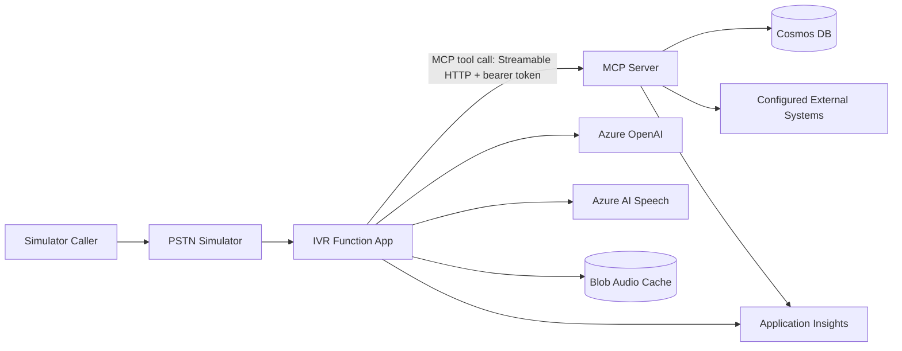
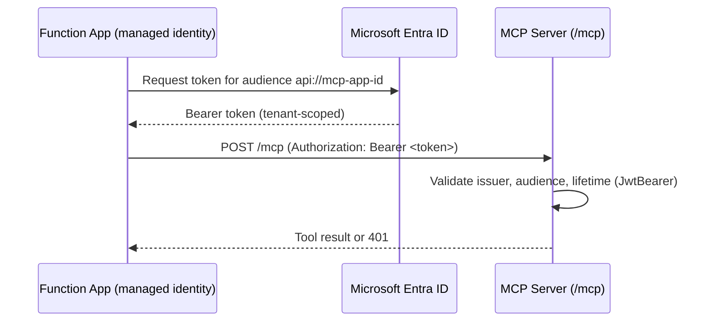

# MCP Workflow Guide

This document describes how the Model Context Protocol (MCP) server fits into the IVR call flow, how it is secured, and what it currently does versus what the [MCP Integration and Deployment Plan](mcp-integration-deployment-plan.md) still calls for.

**Branch:** `MCP_integration` · **Resource group:** `rg-ivr-Mcp` (US Gov Virginia) · **Status:** Infrastructure deployed; all 5 planned tools implemented; Function App client integration not yet enabled.

---

## Table of Contents

1. [Why MCP](#1-why-mcp)
2. [Request Flow](#2-request-flow)
3. [Tool Library](#3-tool-library)
4. [Authentication and Authorization](#4-authentication-and-authorization)
5. [Deployment Topology](#5-deployment-topology)
6. [Configuration Reference](#6-configuration-reference)
7. [Local Development](#7-local-development)
8. [Current Status vs. Plan](#8-current-status-vs-plan)

---

## 1. Why MCP

Azure Functions remains the deterministic Teams/Graph call-control orchestrator — it answers calls, plays prompts, collects DTMF/speech input, and transfers or ends calls. MCP is introduced purely as the **contract and transport for business-data tools** (facility lookups, routing rules, event schedules, call history, call-event recording) so that logic can be reused by other clients later without duplicating Cosmos DB access code. No AI agent autonomously selects or chains tools in this release — the Function App calls specific tools explicitly at specific points in the call flow.

## 2. Request Flow



1. The caller's request reaches the Function App via the PSTN Simulator (or, later, the Teams Calling Bot).
2. For lookups/actions backed by a tool, the Function App's MCP gateway acquires a managed-identity token and calls the MCP server over Streamable HTTP.
3. The MCP server validates the token, executes the tool against Cosmos DB (or a configured external system), and returns a typed response.
4. If the MCP call fails or times out, the Function App falls back to its existing direct-service code path (`Mcp__FallbackToDirect`) so the call flow is never blocked by MCP availability.
5. Function and MCP traces share the call ID and distributed trace context in Application Insights.

## 3. Tool Library

| Tool | Status | Backing behavior | Input → Output |
|---|---|---|---|
| `facility_record_lookup` | **Implemented** (`FacilityTools.cs`) | ANI/ALI lookup | Phone number → facility, location, contact, block status |
| `check_event_schedule` | **Implemented** (`EventScheduleTools.cs`) | `EventScheduleEvaluationService` over the `EventSchedules` container | Facility/device + event time → matching window, approval, contact |
| `get_caller_history` | **Implemented** (`CallHistoryTools.cs`) | Bounded, phone-scoped call-log query | Phone number + limit/date range → summary records (no transcripts) |
| `record_call_event` | **Implemented** (`CallEventTools.cs`) | Idempotent create against the new `CallEvents` container (keyed by callId + eventId) | Call ID, event ID, type, timestamp, details → acknowledgment + `alreadyRecorded` flag |
| `route_admin_call` | **Implemented** (`AdminCallRoutingTools.cs`) | `AdminCallRoutingService` — keyword-matches `TeamRoutingConfig` + `BusinessHoursConfig.IsCurrentlyOpen()` (both already shared in `IVR.Core`) | Call type + facility context → matched team, transfer target, business-hours flag, escalate flag |

All tools follow the same rules: explicit request/response records, schema validation, cancellation tokens, bounded result sizes, structured errors, and tool descriptions that state when the tool should and should not be called. Sensitive fields (credentials, full transcripts) never appear in tool descriptions, logs, or error payloads.

## 4. Authentication and Authorization

The MCP endpoint is Entra-protected even though it has a public App Service hostname:



- The Function App's system-assigned managed identity requests a token for the MCP server's audience — no shared API keys.
- The MCP server validates `ValidIssuer`/`ValidAudience`/lifetime via `JwtBearerDefaults` in [`Program.cs`](../src/IVR.McpServer/Program.cs); Azure Government tenants resolve to the `login.microsoftonline.us` authority instead of the commercial authority.
- `Mcp:RequireAuthentication=false` is only for isolated local/dev use (loopback or the Docker network) and throws at startup if enabled without a tenant/audience configured.
- The MCP server's own managed identity is granted least-privilege access: Cosmos DB data-plane roles and `Key Vault Secrets User` on the environment's Key Vault — nothing broader.

## 5. Deployment Topology

The MCP environment is a fully isolated stack in `rg-ivr-Mcp` — it does **not** share Cosmos DB, Storage, Key Vault, or AI resources with `rg-ivr-teams`.

| Resource | Bicep module | Notes |
|---|---|---|
| MCP App Service | `modules/mcp-server.bicep` | Linux, `DOTNETCORE\|8.0`, Always On, system-assigned identity, HTTPS-only, TLS 1.2 min |
| Function App | `modules/function-app.bicep` | Adds `Mcp__Enabled`, `Mcp__Endpoint`, `Mcp__Audience`, `Mcp__FallbackToDirect` settings |
| Cosmos DB | `modules/cosmos-db.bicep` | Adds the `EventSchedules` container alongside existing containers |
| Key Vault access | `modules/keyvault-access.bicep` | Role-assignment loop now includes the MCP server's principal ID |
| Parameters | `parameters/azuregov-mcp.bicepparam` | `environmentName='mcp'`, `location='usgovvirginia'`; Bot Service deploy disabled (Phase 8 deferred) |

`main.bicep` deploys the MCP server module ahead of the Function App so its hostname and managed-identity principal ID are available to wire into the Function App's settings and the shared Key Vault access module.

## 6. Configuration Reference

### MCP Server (`IVR.McpServer/appsettings.json` / App Service settings)

| Setting | Purpose |
|---|---|
| `Mcp__RequireAuthentication` | Enforce Entra bearer-token validation on `/mcp` |
| `Mcp__TenantId` | Entra tenant issuing tokens for callers |
| `Mcp__Audience` | API application ID URI this server validates tokens against |
| `CosmosDbConnectionString` | Falls back to `SeededInMemoryCosmosDbService` when empty (matches Function App / Admin Portal behavior) |

### Function App (MCP client settings)

| Setting | Purpose | Current value |
|---|---|---|
| `Mcp__Enabled` | Turns on MCP-backed lookups | `false` — client integration (Phase 3) not yet implemented |
| `Mcp__Endpoint` | MCP server base URL | Set from `mcpServer.outputs.defaultHostname` |
| `Mcp__Audience` | Token audience to request | From `mcpAudience` parameter |
| `Mcp__FallbackToDirect` | Preserve direct-service code path during migration | `true` |

## 7. Local Development

The MCP server is not yet added to root [`docker-compose.yml`](../docker-compose.yml) (Phase 4 item). Until then, run it directly:

```powershell
cd src/IVR.McpServer
dotnet run --Mcp:RequireAuthentication=false   # loopback-only, no Entra token needed
```

Point a local Function App instance at it with `Mcp__Endpoint=http://localhost:5000` and `Mcp__Enabled=true` once the Phase 3 client lands.

## 8. Current Status vs. Plan

As of 2026-08-24, `rg-ivr-Mcp` is deployed and all four apps (Function App, MCP server, Admin Portal, Simulator) are running with real code — verified via Kudu file listing and HTTP health checks. All 5 planned tools are now implemented (`facility_record_lookup`, `check_event_schedule`, `get_caller_history`, `record_call_event`, `route_admin_call`). `route_admin_call` turned out not to need `CallFlowEngine`/`TranscriptRoutingService` (those stay `IVR.Functions`-only, untouched) — it's new, purely deterministic keyword/business-hours logic that only needed interfaces already shared in `IVR.Core`. The new `CallEvents` container needs a Bicep redeploy of `rg-ivr-Mcp` before `record_call_event` will work against live Cosmos DB (it currently falls back to in-memory when no connection string is configured). What remains before Phase 6/7 acceptance testing, per [the deployment plan](mcp-integration-deployment-plan.md):

- Redeploy `rg-ivr-Mcp` infrastructure (new `CallEvents` container) and the MCP server app code.
- Build the Function App's MCP gateway/client and flip `Mcp__Enabled` to `true` with fallback instrumentation.
- Add `EventSchedules` management to the Admin Portal and matching Data Seeder records.
- Add the MCP server to `docker-compose.yml` for local integration testing.
- Add unit/protocol-level tests and snapshot-test tool schemas.
- Run simulator acceptance tests (facility lookup, scheduled/unscheduled test, routing, history, event recording) before any Teams integration (Phase 8).


