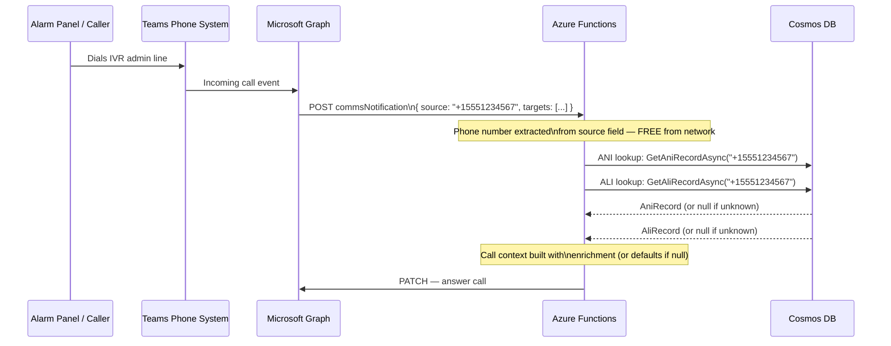
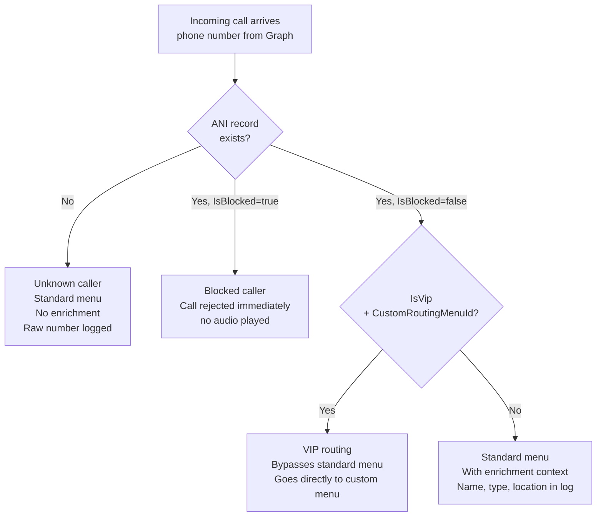

# ANI / ALI Configuration Guide

**Document Version:** 1.0
**Date:** July 28, 2026
**Audience:** Administrators, field engineers, onboarding staff

---

## What Are ANI and ALI?

**ANI (Automatic Number Identification)** and **ALI (Automatic Location Identification)** are pre-registered database records in Cosmos DB that enrich incoming calls with known context about the caller before any interaction begins.

They are **not** what the network delivers — the phone number itself arrives automatically with every call from Microsoft Graph. ANI/ALI records are what the system looks up *using* that phone number to answer: *"Do we know anything about this caller?"*

| Term | What it stores | Example |
|---|---|---|
| **ANI** | Caller identity — name, type, priority, language, routing overrides | Building 4 Fire Panel, CallerType: Internal, Priority: 8 |
| **ALI** | Caller location — address, building, floor, region, service area | 1234 Main St, Building 4, Floor 3, Zone B |

Neither record is required. Unknown callers are handled normally — ANI/ALI enrichment is additive, not a gate.

---

## Purpose and Use Case

The primary use case is **known device registration** — alarm panels, security terminals, HVAC monitoring systems, and facility management endpoints that call in from fixed, predictable phone numbers.

By pre-registering these numbers in Cosmos DB, the system can:

- Identify the device and facility the moment the call arrives — before the caller speaks or presses a key
- Apply caller-specific routing (VIP bypass, custom menu, language override)
- Block known nuisance or test numbers that should never consume operator time
- Produce richer call log entries for compliance and audit (caller name, type, location attached to every event)

### Who benefits most

| Caller type | ANI/ALI value |
|---|---|
| **Alarm panel / security system** | High — fixed number, known device, registered once and permanent |
| **Facility management terminal** | High — fixed number, maps to a specific building and contact |
| **Known facility staff** | Medium — fixed desk phone, name and department useful in logs |
| **Technician on personal cell** | Low — ad hoc number, unlikely to be registered; handled as unknown caller |
| **Walk-up / one-time caller** | None — system treats as unknown, standard menu applies |

---

## How the Phone Number Arrives

The caller's phone number is **not** sourced from the ANI database — it is delivered automatically by Microsoft Graph as part of every incoming call notification. No lookup, no registration required for the number itself to be received.



---

## Call Context Build — Known vs. Unknown Caller

After the lookup, the `CallFlowEngine` builds a `CallContext` object. The `?.` null-coalescing in the code is the key: every ANI/ALI field has a safe default so unknown callers are never rejected for being unregistered.

| Field | Known caller (ANI found) | Unknown caller (ANI null) |
|---|---|---|
| `IsBlocked` | From `AniRecord.IsBlocked` | `false` — not blocked |
| `IsVip` | From `AniRecord.IsVip` | `false` — standard flow |
| `Language` | From `AniRecord.Language` | `"en-US"` — default |
| `AniData` | Full record attached to call log | `null` in call log |
| `AliData` | Full record attached to call log | `null` in call log |

### Three caller tiers



---

## How ANI/ALI Influences Routing

ANI/ALI records shape **how the call is received** — they do not store transfer targets. Where a call is sent is determined separately by `TeamRoutingConfig` and `IvrMenu` option actions.

| ANI/ALI field | Effect on call |
|---|---|
| `IsBlocked = true` | Call rejected immediately before answering |
| `IsVip = true` + `CustomRoutingMenuId` | Bypasses root menu, goes to caller-specific menu |
| `CallerType` | Can trigger a conditional menu branch (e.g. `Internal` callers skip the public greeting) |
| `ali.Region` | Can trigger a region-specific menu for multi-facility deployments |
| `Language` | Sets TTS synthesis and STT recognition language for the entire call |
| `Priority` | Stored in call log; available for future queue prioritization |

Menu conditions are evaluated in `CallFlowEngine.EvaluateConditionsAsync` and can be configured per menu in the Admin Portal without a code change.

---

## Seeding Process

### Development / test environment

The `IVR.DataSeeder` project contains `AniAliSeeder.cs` which generates hardcoded test records (fake phone numbers for residential, business, government, and internal caller types). Running the seeder pushes these to Cosmos DB via `UpsertAniRecordAsync` / `UpsertAliRecordAsync`.

```
cd src/IVR.DataSeeder
dotnet run
```

This populates the 12 ANI and corresponding ALI records used in the current dev deployment.

### Live / production environment — current options

| Method | Status | Notes |
|---|---|---|
| **Admin Portal — Add Record** | ✅ Working | Manual entry at `/ani-ali` — enter one record at a time via form UI |
| **Admin Portal — Import CSV** | ⚠️ UI only | Button exists on `/ani-ali` page but handler is not yet implemented |
| **DataSeeder with customer data** | ✅ Viable | Write a customer-specific seeder (like `SimpleCopySeeder.ps1` does for prompts) populated from the customer's asset list |
| **MCP tool / external integration** | 🔲 Future | `facility_record_lookup` MCP tool could query facility management system directly instead of Cosmos DB |

### Recommended onboarding workflow (today)

For a new facility deployment:

1. Export a list of all fixed-number devices (alarm panels, security terminals, facility phones) from the customer's asset management system — at minimum: phone number, device name, building, floor.
2. Use the **Admin Portal Add Record** flow to create an ANI record for each device.
3. Create a corresponding ALI record if location detail (address, floor, zone) is needed in call logs or conditional routing.
4. Assign `CallerType = Internal` and appropriate `Priority` for known facility devices.
5. For any device that should skip the standard menu, set `IsVip = true` and assign a `CustomRoutingMenuId` pointing to its dedicated fast-path menu.

---

## Data Model Reference

### AniRecord (Cosmos DB container: `ani-records`)

| Field | Type | Purpose |
|---|---|---|
| `phoneNumber` | string (E.164) | Lookup key — must match exactly what Graph delivers |
| `callerName` | string? | Human-readable label for logs and Admin Portal display |
| `accountNumber` | string? | External reference ID (e.g. from facility management system) |
| `callerType` | enum | `Unknown`, `Residential`, `Business`, `Government`, `Internal` |
| `priority` | int | 0 = default; higher = elevated priority in logs |
| `language` | string | BCP-47 tag — drives TTS and STT language selection |
| `isVip` | bool | Routes to `customRoutingMenuId` if set |
| `isBlocked` | bool | Rejects call immediately if true |
| `customRoutingMenuId` | string? | Menu ID to use instead of root menu for this caller |
| `metadata` | Dictionary | Free-form key/value for building, department, device type, etc. |

### AliRecord (Cosmos DB container: `ali-records`)

| Field | Type | Purpose |
|---|---|---|
| `phoneNumber` | string (E.164) | Lookup key — matches ANI record |
| `address.street` | string? | Street address of the device or caller location |
| `address.city` | string? | City |
| `address.state` | string? | State |
| `address.zipCode` | string? | Zip code |
| `coordinates` | GeoCoordinates? | Lat/long for map integration |
| `locationType` | enum | `Residential`, `Commercial`, `Government`, etc. |
| `serviceArea` | string? | Operational zone or district for conditional routing |
| `region` | string? | Used in `AliRegion` menu conditions |
| `timezone` | string | IANA timezone for business hours evaluation |

### Partition key

Both models use the first 4 characters of the phone number as the Cosmos DB partition key, distributing records across partitions by number prefix.

---

## Admin Portal — ANI/ALI Page

The `/ani-ali` page in the Admin Portal provides:

- **Tabbed view** — separate tabs for ANI records and ALI records
- **Search** — by phone number, caller name, or location
- **Add Record** — form to manually create a new ANI or ALI record
- **Edit / Delete** — inline actions per record
- **Import CSV** — button present, implementation pending

Direct URL: `https://<admin-portal-hostname>/ani-ali`

---

## Document Revision History

| Version | Date | Changes |
|---|---|---|
| 1.0 | 2026-07-28 | Initial document — purpose, flow, routing influence, seeding process |
