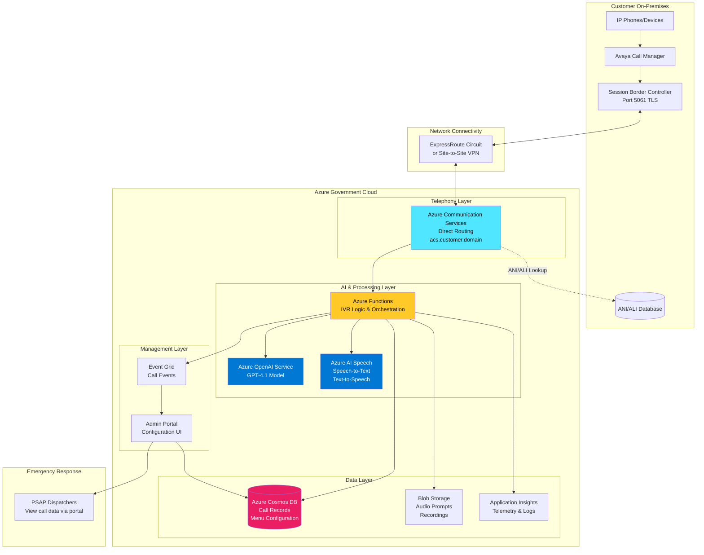
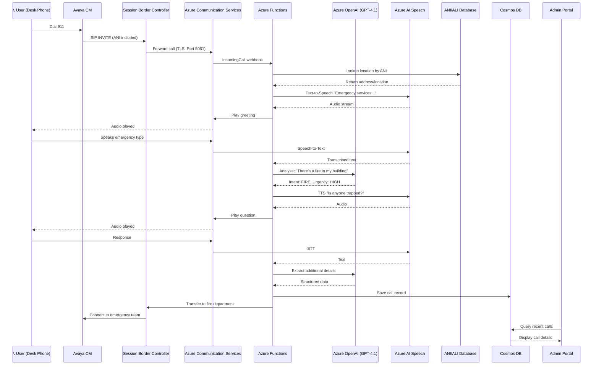
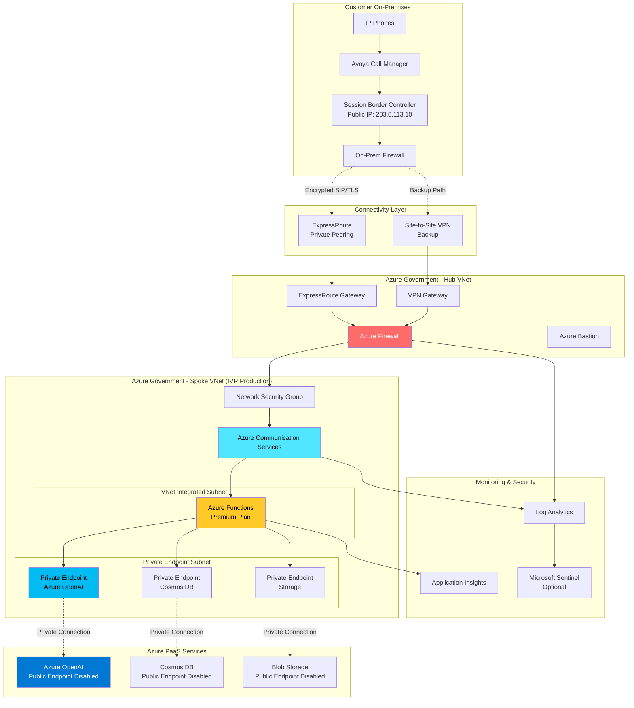

# Customer Integration Overview - E911 IVR System

**Document Version:** 1.0  
**Date:** May 28, 2026  
**Audience:** Customer stakeholders, integration teams, project managers

---

## Executive Summary

This document provides a comprehensive overview of integrating the E911 IVR (Interactive Voice Response) system with a government customer's on-premises telephony infrastructure. The solution leverages Azure Government cloud services, Azure Communication Services Direct Routing, and Azure OpenAI for intelligent emergency call handling.

---

## System Architecture Overview

### High-Level Architecture



---

## Azure OpenAI (AOAI) Integration

### What is Azure OpenAI?

**Azure OpenAI Service** provides REST API access to OpenAI's powerful language models including GPT-4, GPT-3.5-Turbo, Codex, and Embeddings. In this solution, it powers intelligent call handling and natural language understanding.

### GPT-4.1 Model Deployment

**Model:** `gpt-4.1` (deployed in Azure Government)  
**Purpose:** Emergency call analysis and response orchestration

### Use Cases in E911 IVR

#### 1. **Natural Language Understanding (NLU)**

**Scenario:** Caller says something unexpected

```
Traditional IVR:    "Press 1 for Fire, 2 for Medical, 3 for Police"
Caller Response:    "My neighbor's house is on fire!"

AI-Powered Result:  System understands intent → Routes to FIRE
                    Extracts: Location context, urgency level
```

**GPT-4.1 Prompt Example:**
```
System: Analyze this emergency call input and determine intent.
Input: "My neighbor's house is on fire and I think they're inside"
Output: {
  "emergency_type": "FIRE",
  "urgency": "HIGH",
  "additional_info": "possible_victims_trapped",
  "routing": "FIRE_DEPARTMENT_IMMEDIATE"
}
```

#### 2. **Intelligent Call Routing**

**Flow:**
```
1. Caller speaks (Speech-to-Text)
2. Text sent to GPT-4.1 for analysis
3. Model extracts:
   - Emergency type (fire, medical, police, other)
   - Severity level (high, medium, low)
   - Key details (injuries, weapons, hazards)
4. Functions app routes based on AI decision
5. Call transferred to appropriate team
```

#### 3. **Dynamic Conversation Management**

**Adaptive Questioning:**
```
GPT-4.1 Context: Medical emergency detected, breathing difficulty

Generated Questions (context-aware):
- "Is the person conscious?"
- "Are they breathing now?"
- "Do they have a history of heart problems?"

vs. Medical emergency, injury:
- "What type of injury occurred?"
- "Is there heavy bleeding?"
- "Can the person move the injured area?"
```

#### 4. **Location Information Extraction**

**Natural Language Address Parsing:**

| Caller Input | GPT-4.1 Extraction | Validation |
|--------------|-------------------|------------|
| "123 Main Street" | ✅ Standard format | Pass |
| "I'm at the Walmart on Route 50" | ✅ Landmark → 1500 Anytown Plaza | Geocode |
| "Near the old fire station" | ✅ Historical reference → Current address | Confirm |
| "Corner of 5th and Oak" | ✅ Intersection → Exact coordinates | Map lookup |

#### 5. **Call Summary & Documentation**

**Post-Call Processing:**
```
Azure Function → Sends call transcript to GPT-4.1

Prompt: "Summarize this emergency call for dispatcher records"

Output:
┌─────────────────────────────────────────┐
│ CALL SUMMARY                            │
├─────────────────────────────────────────┤
│ Type:     Medical Emergency             │
│ Location: 123 Main St, Anytown, XX     │
│ Caller:   Neighbor at 121 Main St       │
│ Patient:  Elderly male, 70s             │
│ Symptoms: Chest pain, shortness breath  │
│ Status:   Conscious, unable to stand    │
│ Actions:  Caller unlocking front door   │
│ Priority: HIGH - Ambulance dispatched   │
└─────────────────────────────────────────┘

Stored in Cosmos DB for PSAP dispatcher view
```

#### 6. **Multi-Language Support**

**Automatic Language Detection:**
```
Caller Input (Spanish): "Necesito ayuda, hay un incendio"

GPT-4.1 Processing:
- Detects language: Spanish
- Translates intent: "Need help, there's a fire"
- Determines emergency type: FIRE
- Responds in Spanish: "¿Cuál es su ubicación?"
```

#### 7. **Stress & Emotion Analysis**

**Context-Aware Response:**
```
Speech-to-Text: "Help! Someone's trying to break in!"
(High volume, rapid speech, background noise)

GPT-4.1 Analysis:
- Emotion: Fear/Panic (HIGH)
- Urgency: Immediate
- Tone Adjustment: Calm, reassuring, direct

Generated Response:
"Help is on the way. I need you to stay calm and tell me 
 where you are right now. Are you in a safe location?"
```

---

## Key Integration Components

### 1. Network Connectivity

**Critical for Voice Quality:**

| Component | Requirement | Purpose |
|-----------|-------------|---------|
| **ExpressRoute** | 100+ Mbps, < 50ms latency | Primary connectivity to Azure Gov |
| **Site-to-Site VPN** | 50+ Mbps (backup) | Redundant path |
| **QoS (DSCP 46)** | Enabled | Prioritize voice traffic |
| **Bandwidth** | 150 Kbps per concurrent call | Voice + overhead |

**Bandwidth Planning:**
```
Example: 100 concurrent calls
= 100 calls × 150 Kbps × 1.3 (overhead) = ~20 Mbps minimum
Recommended: 100 Mbps ExpressRoute (5x headroom for growth)
```

### 2. DNS Configuration

**Custom Domain Requirements:**

**Option A: Subdomain Delegation (Recommended)**
```
Customer manages:    customer.gov
Azure DNS manages:   acs.customer.gov (delegated)

Benefits:
✅ Faster Azure configuration changes
✅ Automatic certificate renewal
✅ Reduced coordination overhead

Requirements:
- NS record delegation in customer's DNS
- TXT record for domain verification
```

**Option B: Customer-Managed DNS**
```
Customer manages:    customer.gov and acs.customer.gov

Benefits:
✅ Customer retains full DNS control
✅ Internal CA integration possible

Requirements:
- Manual TXT record addition for verification
- Longer turnaround for DNS changes
- Coordination required for certificates
```

**DNS Records Needed:**
```
Type: TXT
Name: acs.customer.gov
Value: MS=ms12345678 (provided by Azure)
TTL:  3600 (1 hour)

Type: CNAME (after verification)
Name: sip.acs.customer.gov
Value: acs-sip.communication.azure.us
TTL:  3600
```

### 3. Session Border Controller (SBC)

**SBC Requirements for ACS Direct Routing:**

| Requirement | Details | Notes |
|-------------|---------|-------|
| **FQDN** | sbc.customer.gov | IP addresses NOT supported |
| **Certificate** | Public CA or internal CA | Must match FQDN |
| **Port** | 5061 (TLS) | TCP + UDP |
| **SIP Protocol** | RFC 3261 compliant | SIP OPTIONS required |
| **Codecs** | G.711, G.722, SILK | HD audio preferred |
| **Azure Certified** | Preferred | See: aka.ms/sbclist |

**SBC Placement Options:**

```
Option 1: On-Premises SBC
┌─────────────────────────────────────┐
│ Customer Data Center                │
│                                     │
│  Avaya CM ──> Existing SBC ─────┐  │
│                                 │  │
└─────────────────────────────────┼──┘
                                  │
                        ExpressRoute/VPN
                                  │
                            Azure ACS

Benefits: Use existing SBC, no Azure VM costs
Drawbacks: Requires public IP, firewall config
```

```
Option 2: Azure-Hosted SBC
┌─────────────────────┐      ┌─────────────────────┐
│ Customer On-Prem    │      │ Azure Government    │
│                     │      │                     │
│  Avaya CM ──────────┼──────┼──> SBC VM ──> ACS   │
│                     │      │    (Azure)          │
└─────────────────────┘      └─────────────────────┘
              ExpressRoute/VPN

Benefits: No public IP needed, managed in Azure
Drawbacks: VM costs, requires ExpressRoute
```

```
Option 3: Hybrid Multi-Site
┌──────────────┐      ┌──────────────┐
│ Site 1 SBC   ├──┐   │ Azure ACS    │
└──────────────┘  │   └──────────────┘
                  ├──>
┌──────────────┐  │
│ Site 2 SBC   ├──┘
└──────────────┘

Benefits: Geographic redundancy, site-specific routing
Drawbacks: Complex configuration, higher cost
```

### 4. Certificate Management

**TLS Certificate Requirements:**

**Option A: Public Certificate Authority (Recommended)**
```
CA:        DigiCert, Let's Encrypt, etc.
FQDN:      sbc.customer.gov
           acs.customer.gov
Chain:     Root + Intermediate + Leaf
Renewal:   90 days (automated via ACME)
Cost:      $0-500/year

Benefits:
✅ Azure automatically trusts public CAs
✅ Easy renewal automation
✅ No PKI infrastructure needed
```

**Option B: Internal Certificate Authority**
```
CA:        Customer's Enterprise CA
FQDN:      sbc.customer.gov
Chain:     Internal Root + Intermediate + Leaf
Renewal:   1-3 years (manual process)
Cost:      $0 (internal)

Requirements:
⚠️  Must upload root/intermediate certs to Azure
⚠️  Certificate approval process (2-8 weeks)
⚠️  Manual renewal coordination

Benefits:
✅ Meets internal security policies
✅ No external dependencies
```

**Certificate Timeline:**
```
Public CA:   1-2 days (automated)
Internal CA: 2-8 weeks (approval + upload + configuration)
```

### 5. ANI/ALI Database Integration

**Automatic Number Identification / Automatic Location Identification**

**Integration Pattern:**
```
Incoming Call → ACS → Azure Function
                      │
                      ├─> Extract Caller ID (ANI)
                      │
                      ├─> Query Customer ANI/ALI Database
                      │   (via ExpressRoute/private endpoint)
                      │
                      └─> Retrieve:
                          - Physical address
                          - Building/floor/suite
                          - Special instructions
                          - Contact information
```

**Database Options:**

| Option | Protocol | Latency | Complexity |
|--------|----------|---------|------------|
| **REST API** | HTTPS | < 100ms | Low |
| **Direct SQL** | SQL Server | < 50ms | Medium |
| **File Export** | CSV/JSON | Varies | High |
| **NENA i3** | SIP | < 50ms | High |

**Recommended:** REST API over ExpressRoute private endpoint

**API Contract Example:**
```json
Request:
GET https://ani-api.customer.internal/lookup?ani=+15551234567

Response:
{
  "ani": "+15551234567",
  "location": {
    "address": "123 Main Street",
    "city": "Anytown",
    "state": "XX",
    "zip": "12345",
    "building": "Building A",
    "floor": "3",
    "suite": "302"
  },
  "caller": {
    "name": "John Doe",
    "department": "IT",
    "emergency_contact": "+15559876543"
  },
  "special_instructions": "Near north stairwell",
  "confidence": "HIGH"
}
```

### 6. Azure OpenAI Configuration

**Deployment Details:**

| Setting | Value | Notes |
|---------|-------|-------|
| **Service** | Azure OpenAI | Azure Government region |
| **Model** | GPT-4.1 | Latest available |
| **Deployment Name** | ivr-gpt4 | Custom naming |
| **Capacity (TPM)** | 100,000+ | Tokens per minute |
| **Region** | USGov Virginia | Gov cloud only |

**Quota Planning:**

```
Concurrent Calls: 50
Average Tokens per Call: 1,500 tokens
Call Duration: 3 minutes
Peak Hour Calls: 150 calls

Tokens Per Minute (TPM) Required:
= (150 calls/hour × 1,500 tokens) / 60 minutes
= 3,750 TPM minimum

Recommended: 10,000+ TPM (2.5x buffer)
```

**Cost Estimation:**

```
GPT-4.1 Pricing (Azure Gov, approximate):
Input:  $0.03 per 1K tokens
Output: $0.06 per 1K tokens

Per Call Cost:
= (1,000 input + 500 output tokens) × pricing
= (1.0 × $0.03) + (0.5 × $0.06)
= $0.03 + $0.03 = $0.06 per call

Monthly Cost (10,000 calls):
= 10,000 × $0.06 = $600/month for AI processing
```

**Security & Compliance:**

```
✅ Private Endpoint: Functions → Azure OpenAI (no internet)
✅ Managed Identity: No API keys in code
✅ RBAC: Least privilege access
✅ Audit Logging: All API calls logged
✅ Data Residency: All data stays in Azure Gov
✅ Encryption: At rest + in transit (TLS 1.3)
```

---

## Critical Discovery Items (Pre-Contract)

### Network & Connectivity

**Questions to Ask:**

1. **ExpressRoute Availability**
   - [ ] Does customer have existing ExpressRoute to Azure Gov?
   - [ ] Current bandwidth: _____ Mbps
   - [ ] Current latency: _____ ms
   - [ ] Available capacity for voice traffic: _____ Mbps
   - [ ] Lead time for new circuit: _____ weeks

2. **VPN Capabilities**
   - [ ] Site-to-Site VPN available?
   - [ ] VPN bandwidth: _____ Mbps
   - [ ] Acceptable for voice as backup? Yes/No
   - [ ] Firewall rules approval process: _____ weeks

3. **QoS Configuration**
   - [ ] Is QoS enabled on network? Yes/No
   - [ ] DSCP marking supported? Yes/No
   - [ ] Who manages QoS policies? _____
   - [ ] Timeline to enable QoS: _____ weeks

4. **Bandwidth Requirements**
   - [ ] Peak concurrent calls: _____ calls
   - [ ] Current voice bandwidth usage: _____ Mbps
   - [ ] Future growth estimate (3 years): _____ calls
   - [ ] Network capacity buffer: _____ % available

### Telephony Infrastructure

**Questions to Ask:**

1. **Avaya Call Manager**
   - [ ] Version: _____ (must be compatible)
   - [ ] Number of sites: _____
   - [ ] Total users: _____
   - [ ] Current E911 solution: _____
   - [ ] SIP trunking experience: Yes/No

2. **Session Border Controller (SBC)**
   - [ ] Existing SBC: Yes/No
   - [ ] SBC Vendor: _____
   - [ ] SBC Model: _____
   - [ ] Azure certified? Yes/No (check: aka.ms/sbclist)
   - [ ] Firmware version: _____
   - [ ] Location: On-prem / Azure / Hosted

3. **Phone Numbers**
   - [ ] Current provider: _____
   - [ ] Number of DIDs: _____
   - [ ] Emergency-only numbers: _____
   - [ ] Porting required? Yes/No
   - [ ] Port lead time: _____ weeks

### DNS Infrastructure

**Questions to Ask:**

1. **DNS Management**
   - [ ] Who manages DNS? Team/Vendor: _____
   - [ ] DNS provider: _____
   - [ ] Change approval process: _____
   - [ ] Average change turnaround: _____ days
   - [ ] After-hours support available? Yes/No

2. **Domain Ownership**
   - [ ] Primary domain: _____
   - [ ] Can delegate subdomain? Yes/No
   - [ ] Preferred subdomain: acs._____.gov
   - [ ] External DNS resolution required? Yes/No
   - [ ] Internal DNS split-horizon? Yes/No

3. **DNS Zone Management**
   - [ ] Hosted zone location: Internal/Cloud/Hybrid
   - [ ] DNSSEC enabled? Yes/No
   - [ ] Anycast DNS? Yes/No
   - [ ] Geo-redundant? Yes/No

### Certificate Management

**Questions to Ask:**

1. **Certificate Authority**
   - [ ] Internal CA? Yes/No
   - [ ] Public CA preference: _____
   - [ ] Certificate approval process: _____
   - [ ] Approval timeline: _____ weeks
   - [ ] Who submits CSRs? _____
   - [ ] Renewal process: Manual/Automated

2. **Certificate Requirements**
   - [ ] TLS version: 1.2 / 1.3 (minimum)
   - [ ] Key size: 2048 / 4096 bit
   - [ ] Certificate lifetime: _____ days
   - [ ] SAN (Subject Alternative Names) allowed? Yes/No
   - [ ] Wildcard certificates allowed? Yes/No

3. **PKI Integration**
   - [ ] Root CA chain available? Yes/No
   - [ ] Can export root/intermediate certs? Yes/No
   - [ ] CRL/OCSP endpoints accessible? Yes/No
   - [ ] Azure upload approval process: _____

### ANI/ALI Database

**Questions to Ask:**

1. **Database Details**
   - [ ] Database type: SQL/Oracle/Custom
   - [ ] Version: _____
   - [ ] Location: On-prem/Cloud
   - [ ] API available? Yes/No
   - [ ] API protocol: REST/SOAP/SQL
   - [ ] Authentication: OAuth/API Key/Certificate

2. **Data Access**
   - [ ] Read-only access sufficient? Yes/No
   - [ ] Network path to database: _____
   - [ ] Latency requirements: < _____ ms
   - [ ] High availability setup? Yes/No
   - [ ] Disaster recovery: Yes/No

3. **Data Format**
   - [ ] Address format: USPS/Custom
   - [ ] Geocoding available? Yes/No
   - [ ] Location confidence score? Yes/No
   - [ ] Special instructions field? Yes/No
   - [ ] Update frequency: Real-time/Batch

### Security & Compliance

**Questions to Ask:**

1. **Compliance Requirements**
   - [ ] FedRAMP: High/Moderate/None
   - [ ] CJIS: Yes/No
   - [ ] ITAR: Yes/No
   - [ ] StateRAMP: Yes/No
   - [ ] NIST 800-171: Yes/No
   - [ ] Other: _____

2. **Security Policies**
   - [ ] MFA required? Yes/No
   - [ ] Zero Trust architecture? Yes/No
   - [ ] Privileged Access Workstations? Yes/No
   - [ ] VPN required for admin access? Yes/No
   - [ ] Security scanning required? Yes/No

3. **Data Retention**
   - [ ] Call recording required? Yes/No
   - [ ] Retention period: _____ days/years
   - [ ] Data residency requirements: _____
   - [ ] Backup requirements: _____
   - [ ] Audit log retention: _____ years

### Azure Environment

**Questions to Ask:**

1. **Azure Gov Tenant**
   - [ ] Existing tenant? Yes/No
   - [ ] Tenant ID: _____
   - [ ] Procurement timeline: _____ weeks
   - [ ] CSP/EA/PAYG: _____

2. **Subscription Setup**
   - [ ] Existing subscription? Yes/No
   - [ ] Subscription quota limits: _____
   - [ ] Spending limits: $_____/month
   - [ ] Budget approval process: _____

3. **Landing Zone**
   - [ ] Hub-spoke network configured? Yes/No
   - [ ] Resource naming convention: _____
   - [ ] Resource tagging requirements: _____
   - [ ] Cost allocation/chargeback: Yes/No

---

## Azure Foundation Requirements

### Timeline: 4-8 Weeks

### 1. Azure Government Tenant

**Procurement Options:**

| Option | Timeline | Best For |
|--------|----------|----------|
| **EA (Enterprise Agreement)** | 4-8 weeks | Large deployments (> 100 users) |
| **CSP (Cloud Solution Provider)** | 2-4 weeks | Medium deployments (managed) |
| **PAYG (Pay-As-You-Go)** | 1-2 weeks | Small/pilot deployments |

**Required Information:**
- Organization legal name
- Tax ID / DUNS number
- Authorized signatory
- Billing contact
- Technical contact

### 2. Subscription Configuration

**Required Subscriptions:**

```
Production Subscription
├─ Resource Group: rg-ivr-prod
│  ├─ Azure Communication Services
│  ├─ Azure Functions (Premium)
│  ├─ Azure OpenAI Service
│  ├─ Cosmos DB
│  ├─ Application Insights
│  └─ Storage Account
│
└─ Resource Group: rg-ivr-prod-networking
   ├─ Virtual Network
   ├─ Private Endpoints
   ├─ ExpressRoute Gateway
   └─ DNS Zone (if delegated)

Non-Production Subscription
├─ Resource Group: rg-ivr-dev
└─ Resource Group: rg-ivr-test
```

### 3. Landing Zone Setup

**Hub-Spoke Network Design:**

```
┌──────────────────────────────────────────────┐
│ Hub VNet (10.0.0.0/16)                       │
│                                              │
│  ├─ Azure Firewall (10.0.1.0/24)            │
│  ├─ ExpressRoute Gateway (10.0.2.0/27)      │
│  ├─ VPN Gateway (10.0.3.0/27) [backup]      │
│  └─ Bastion (10.0.4.0/27) [admin access]    │
│                                              │
└──────────────────┬───────────────────────────┘
                   │
                   │ VNet Peering
                   │
        ┌──────────┴──────────┐
        │                     │
┌───────▼──────┐     ┌────────▼───────┐
│ Spoke VNet   │     │ Spoke VNet     │
│ (Production) │     │ (Non-Prod)     │
│ 10.1.0.0/16  │     │ 10.2.0.0/16    │
│              │     │                │
│ ├─ ACS       │     │ ├─ Dev/Test    │
│ ├─ Functions │     │ └─ Staging     │
│ ├─ OpenAI    │     └────────────────┘
│ └─ Cosmos DB │
└──────────────┘
```

**Subnet Planning:**

| Subnet | CIDR | Purpose |
|--------|------|---------|
| ACS-Subnet | 10.1.1.0/24 | Communication Services |
| Functions-Subnet | 10.1.2.0/24 | Azure Functions (VNet integrated) |
| PrivateEndpoints-Subnet | 10.1.3.0/24 | Private endpoints (OpenAI, Cosmos) |
| Management-Subnet | 10.1.4.0/24 | Admin Portal, DevOps agents |

### 4. Governance & Compliance

**Azure Policy Assignments:**

```yaml
Required Policies:
- Allowed Locations: [USGov Virginia, USGov Arizona]
- Allowed Resource Types: [approved Azure services only]
- Require Tags: [environment, costcenter, owner, project]
- Network Security: [NSG required, no public IPs on Functions]
- Encryption: [TLS 1.2+, encryption at rest required]
- Identity: [Managed Identity required, no API keys]
- Monitoring: [Diagnostic logs to Log Analytics]
```

**RBAC Configuration:**

| Role | Azure RBAC | Resources | Members |
|------|-----------|-----------|---------|
| **Platform Admin** | Owner | Subscription | IT Leadership |
| **Network Admin** | Network Contributor | Networking RG | Network Team |
| **IVR Admin** | Contributor | IVR RGs | IVR Admins |
| **Developer** | Reader + specific write | IVR RGs | Dev Team |
| **Auditor** | Reader + Security Reader | All | Compliance Team |

---

## Integration Testing Plan

### Phase 1: Network Connectivity (Week 1-2)

**Test Cases:**

```
TC-001: ExpressRoute Connectivity
- [ ] Verify BGP peering established
- [ ] Test latency < 50ms to Azure Gov
- [ ] Validate bandwidth ≥ 100 Mbps
- [ ] Confirm redundant paths active

TC-002: VPN Backup Connectivity
- [ ] Site-to-Site VPN established
- [ ] Failover test (primary down)
- [ ] Recovery time < 5 minutes
- [ ] Voice quality acceptable on VPN

TC-003: QoS Validation
- [ ] DSCP 46 marking applied to voice
- [ ] Priority queuing configured
- [ ] Jitter < 15ms during load
- [ ] Packet loss < 0.1%
```

### Phase 2: SBC Integration (Week 3-4)

**Test Cases:**

```
TC-010: SBC to ACS Connectivity
- [ ] TLS handshake successful
- [ ] SIP OPTIONS heartbeat working
- [ ] Certificate validation passing
- [ ] DNS resolution correct

TC-011: Inbound Call Routing
- [ ] Call from Avaya → SBC → ACS → Functions
- [ ] ANI passed correctly
- [ ] DTMF tones received
- [ ] Audio quality HD (G.722)

TC-012: Outbound Call Routing (if required)
- [ ] Call from Functions → ACS → SBC → Avaya
- [ ] Caller ID presentation
- [ ] Call transfer working
- [ ] Hold music functioning
```

### Phase 3: AI & Speech Services (Week 5-6)

**Test Cases:**

```
TC-020: Azure OpenAI Integration
- [ ] Function app can call GPT-4.1
- [ ] Response time < 2 seconds
- [ ] Token usage within quota
- [ ] Error handling graceful

TC-021: Speech-to-Text
- [ ] Real-time transcription working
- [ ] Accuracy > 90% (clear speech)
- [ ] Handle background noise
- [ ] Profanity filtering (if required)

TC-022: Text-to-Speech
- [ ] Natural voice quality
- [ ] Pronunciation correct
- [ ] Volume levels appropriate
- [ ] No robotic artifacts
```

### Phase 4: ANI/ALI Integration (Week 7-8)

**Test Cases:**

```
TC-030: ANI Lookup
- [ ] Extract caller ID from SIP header
- [ ] Query ANI database successfully
- [ ] Response time < 500ms
- [ ] Handle missing ANI gracefully

TC-031: ALI Retrieval
- [ ] Retrieve location by ANI
- [ ] Address format standardized
- [ ] Building/floor/suite correct
- [ ] Special instructions present

TC-032: Location Validation
- [ ] Geocoding working (if enabled)
- [ ] Confidence score returned
- [ ] Fallback to default location
- [ ] Admin override capability
```

### Phase 5: End-to-End Testing (Week 9-10)

**Test Scenarios:**

```
Scenario 1: Standard Emergency Call
1. User dials 911 from desk phone
2. Avaya routes to SBC
3. SBC forwards to ACS Direct Routing
4. ACS triggers Azure Function
5. Function queries ANI/ALI database
6. Function calls Azure OpenAI for intent
7. System plays appropriate prompts
8. Call routed to correct emergency team
9. Call summary saved to Cosmos DB
10. Admin portal shows call details

Expected: < 10 seconds to first prompt

Scenario 2: Ambiguous Location
1. Caller provides partial address
2. GPT-4.1 extracts known information
3. System asks clarifying questions
4. Location confirmed and verified
5. Emergency team dispatched

Expected: AI assists in gathering complete info

Scenario 3: High Call Volume
1. Simulate 50 concurrent calls
2. All calls answered < 5 seconds
3. No degraded audio quality
4. No dropped calls
5. AI responses consistent

Expected: System handles peak load

Scenario 4: Network Failover
1. Primary ExpressRoute goes down
2. Traffic fails over to VPN
3. Calls continue with minimal disruption
4. Voice quality remains acceptable
5. Primary path restored automatically

Expected: < 1 minute failover, no dropped calls
```

---

## Deployment Timeline

### Optimistic Scenario: 4-6 Months

**Assumes:**
- Existing ExpressRoute available
- Customer has Azure Gov tenant
- Public CA certificates
- REST API for ANI/ALI available
- Experienced integration team
- Minimal bureaucracy

### Realistic Scenario: 6-12 Months

**Typical Government Deployment:**

| Phase | Duration | Dependencies |
|-------|----------|--------------|
| **Discovery & Planning** | 4-6 weeks | Contract signed, stakeholders identified |
| **Azure Foundation** | 4-8 weeks | Tenant procurement, subscription setup |
| **Network Connectivity** | 8-12 weeks | ExpressRoute provisioning, firewall rules |
| **DNS & Certificates** | 4-8 weeks | Internal CA approval, DNS delegation |
| **SBC Configuration** | 2-4 weeks | SBC access, Avaya coordination |
| **IVR Deployment** | 2-4 weeks | Code deployment, configuration |
| **Integration Testing** | 4-6 weeks | All systems available, test window |
| **UAT & Training** | 2-4 weeks | End users, dispatchers, admins |
| **Production Cutover** | 1-2 weeks | Change control, rollback plan |
| **Hypercare & Optimization** | 4 weeks | Post-launch support, tuning |

**Total: 6-12 months**

### Conservative Scenario: 12-18 Months

**Complex Government Deployment:**

**Additional Factors:**
- No existing Azure tenant (add 8-12 weeks)
- No ExpressRoute (add 12-16 weeks for circuit)
- Internal CA certificates (add 6-8 weeks for approval)
- Custom ANI/ALI integration (add 8-12 weeks for API development)
- Multiple sites with separate SBCs (add 4-8 weeks per site)
- Extensive compliance reviews (add 8-16 weeks)
- Government fiscal year budget cycles (variable delay)

---

## Risk Assessment & Mitigation

### Critical Risks

| Risk | Probability | Impact | Mitigation |
|------|-------------|--------|------------|
| **ExpressRoute delays** | High | High | Order immediately, use VPN temporarily |
| **Certificate approval delays** | Medium | High | Start approval early, consider public CA |
| **ANI/ALI API unavailable** | Medium | High | Build file-based fallback, manual lookup |
| **Azure OpenAI quota limits** | Low | Medium | Request quota increase early, multi-region |
| **SBC compatibility issues** | Medium | High | Verify Azure certification, lab testing |
| **DNS delegation blocked** | Low | Medium | Use customer-managed DNS, longer cycle time |
| **Network latency > 150ms** | Medium | High | Choose closest Azure Gov region, optimize path |
| **Budget overruns** | Medium | Medium | Phased rollout, pilot first, then scale |

### Mitigation Strategies

**Network Risks:**
```
1. Order ExpressRoute as soon as contract signed (8-12 week lead time)
2. Configure Site-to-Site VPN as backup (can handle < 25 concurrent calls)
3. Measure latency from each customer site to Azure Gov regions
4. Enable QoS (DSCP 46) on all network equipment
5. Budget 2x bandwidth for growth (100 calls = 200 Mbps circuit)
```

**SBC Risks:**
```
1. Verify SBC is on Azure certified list: aka.ms/sbclist
2. Schedule SBC firmware upgrade if needed (coordinate with vendor)
3. Lab test SBC-to-ACS connectivity before production
4. Have SBC vendor support contract active during deployment
5. Document SBC configuration for disaster recovery
```

**AI Service Risks:**
```
1. Request Azure OpenAI quota increase early (10,000+ TPM)
2. Implement retry logic with exponential backoff
3. Monitor token usage and set alerts at 80% quota
4. Have fallback to rule-based system if AI unavailable
5. Cache common AI responses to reduce API calls
```

**Integration Risks:**
```
1. Request ANI/ALI API access early (may require internal approvals)
2. Build mock API for testing before production API available
3. Implement caching for ANI/ALI lookups (reduce latency)
4. Have manual lookup process documented for API failures
5. Monitor API health and response times continuously
```

---

## Cost Estimation

### Azure Services Monthly Cost (50 concurrent calls)

| Service | SKU | Quantity | Cost/Month |
|---------|-----|----------|------------|
| **Azure Communication Services** | Direct Routing | 15,000 min | $300 |
| **Azure Functions** | Premium EP1 | 1 instance | $146 |
| **Azure OpenAI** | GPT-4.1 | 10K calls | $600 |
| **Azure AI Speech** | Standard | 15,000 min | $225 |
| **Cosmos DB** | Provisioned 400 RU/s | 400 RU/s | $24 |
| **Blob Storage** | Standard LRS | 100 GB | $5 |
| **Application Insights** | Pay-as-you-go | 5 GB | $12 |
| **Virtual Network** | Standard | 1 VNet | $0 |
| **Private Endpoints** | Standard | 3 endpoints | $22 |
| **ExpressRoute** | 100 Mbps | 1 circuit | $550 |
| **DNS Zone** | Hosted | 1 zone | $1 |
| | | **TOTAL** | **$1,885/month** |

**Annual Cost:** ~$22,600

### Scaling Cost (100 concurrent calls)

| Service | Cost Change |
|---------|-------------|
| ACS Direct Routing | $300 → $600 (+$300) |
| Azure Functions | $146 → $292 (+$146) |
| Azure OpenAI | $600 → $1,200 (+$600) |
| Speech Services | $225 → $450 (+$225) |
| Cosmos DB | $24 → $48 (+$24) |
| ExpressRoute | $550 → $1,100 (+$550) |
| Other | Minimal change |
| **TOTAL** | **$1,885 → $3,740/month** |

**Annual Cost (100 calls):** ~$45,000

### One-Time Setup Costs

| Item | Cost | Notes |
|------|------|-------|
| **ExpressRoute Circuit Setup** | $5,000 | Carrier installation fee |
| **SBC Hardware/License** (if new) | $10,000-50,000 | Depends on vendor |
| **Public CA Certificates** | $500/year | DigiCert, etc. |
| **Professional Services** | $50,000-150,000 | Integration, testing, training |
| **Project Management** | $30,000-60,000 | 6-12 months |

**Total Setup:** $95,000 - $265,000 (one-time)

---

## Success Criteria

### Technical Metrics

| Metric | Target | Measurement |
|--------|--------|-------------|
| **Call Setup Time** | < 5 seconds | Time from dial to first prompt |
| **AI Response Time** | < 2 seconds | GPT-4.1 processing latency |
| **Voice Quality (MOS)** | > 4.0 | Mean Opinion Score |
| **Network Latency** | < 50ms | Round-trip to Azure Gov |
| **Packet Loss** | < 0.1% | Voice traffic only |
| **Jitter** | < 15ms | Voice traffic consistency |
| **Call Success Rate** | > 99.9% | Calls completed successfully |
| **System Availability** | > 99.95% | Uptime per month |

### Business Metrics

| Metric | Target | Measurement |
|--------|--------|-------------|
| **Call Handling Time** | Reduced by 20% | Avg time per call |
| **Location Accuracy** | > 95% | Correct address provided |
| **Dispatcher Satisfaction** | > 4.5/5 | Post-deployment survey |
| **Emergency Response Time** | Baseline +/- 0% | Time to dispatch |
| **User Training Time** | < 2 hours | Admin portal training |
| **Cost per Call** | < $0.25 | Total cost / call volume |

### Compliance Metrics

| Requirement | Status | Evidence |
|-------------|--------|----------|
| **Data Residency** | ✅ | All data in Azure Gov USGov Virginia |
| **Encryption in Transit** | ✅ | TLS 1.3 enforced |
| **Encryption at Rest** | ✅ | Azure platform encryption enabled |
| **Audit Logging** | ✅ | All API calls logged to Log Analytics |
| **RBAC** | ✅ | Least privilege access documented |
| **Disaster Recovery** | ✅ | Multi-region failover tested |

---

## Next Steps

### Immediate Actions (Week 1-2)

1. **Review this document** with your internal team
2. **Schedule discovery session** with customer (post-contract)
3. **Customize discovery questionnaire** for specific customer
4. **Validate Azure Gov feature availability** for all services
5. **Prepare statement of work (SOW)** with timeline and deliverables

### Pre-Contract Actions (Weeks 3-4)

1. **Initial customer meeting** - Present solution architecture
2. **Technical discovery call** - Gather environment details
3. **Network assessment** - Measure latency, bandwidth
4. **Proof of concept proposal** - Define pilot scope
5. **Cost estimate finalization** - Based on actual requirements

### Post-Contract Actions (Month 1)

1. **Project kickoff** - All stakeholders
2. **Azure Gov tenant setup** - Begin procurement
3. **ExpressRoute order** - 8-12 week lead time
4. **SBC assessment** - Verify Azure compatibility
5. **ANI/ALI API discovery** - Request access, document API

---

## Appendix A: Reference Architecture Diagrams

### Detailed Call Flow



### Network Security Architecture



---

## Appendix B: Helpful Resources

### Documentation Links

- **Azure Communication Services Direct Routing:** https://learn.microsoft.com/azure/communication-services/concepts/telephony/direct-routing-infrastructure
- **Azure OpenAI Service:** https://learn.microsoft.com/azure/ai-services/openai/
- **Azure Government Documentation:** https://learn.microsoft.com/azure/azure-government/
- **Certified SBC List:** https://aka.ms/sbclist
- **ExpressRoute Overview:** https://learn.microsoft.com/azure/expressroute/

### Support Contacts

| Team | Contact | Purpose |
|------|---------|---------|
| **Azure Communication Services** | acshelp@microsoft.com | Direct Routing configuration |
| **Azure OpenAI Support** | Portal support ticket | Quota increases, technical issues |
| **ExpressRoute Support** | Portal support ticket | Circuit provisioning, BGP issues |
| **Azure Government Sales** | azuregov@microsoft.com | Tenant procurement, licensing |

### Tools & Utilities

- **Azure Speed Test:** https://azurespeed.com/ (test latency to regions)
- **SIP Tester:** https://www.siptester.com/ (validate SBC connectivity)
- **DNS Checker:** https://dnschecker.org/ (verify DNS propagation)
- **SSL Checker:** https://www.sslshopper.com/ssl-checker.html (validate certificates)

---

**Document End**

*For questions or clarifications, contact the IVR Development Team.*
