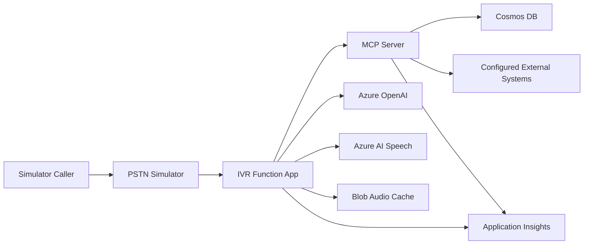

# MCP Integration and Deployment Plan

**Status:** Approved architecture; implementation pending  
**Branch:** `MCP_integration`  
**Target resource group:** `rg-ivr-Mcp`  
**Region:** US Gov Virginia (`usgovvirginia`)  
**Deployment mode:** MCP tools only; no AI agents

## 1. Confirmed Decisions

| Decision | Selection |
|---|---|
| Live call owner | Azure Functions remains the deterministic Teams/Graph call-control orchestrator |
| MCP scope | MCP tools provide business data and actions; no AI agents are deployed |
| Initial call source | PSTN Simulator first; Teams bot integration follows acceptance testing |
| Event schedules | Add the missing schedule model, Cosmos DB container, seeder data, Admin Portal configuration, and MCP tool in phase 1 |
| Environment isolation | Deploy a complete independent stack, including Azure OpenAI and Azure AI Speech |
| Migration safety | Retain direct service access as a temporary fallback until MCP parity and resilience are proven |

"MCP-only" does not mean replacing Azure Functions. MCP is the contract and transport for tools; Azure Functions remains responsible for answering calls, collecting input, playing prompts, and transferring or ending calls.

## 2. Target Architecture

The new environment duplicates the existing IVR stack in a separate resource group and adds a dedicated MCP server. The live request path is:

The Function App invokes MCP tools explicitly for live-call operations. GPT-4.1 continues to perform transcript classification and structured extraction, but it does not autonomously select or execute tools in this release.

## 3. Azure Resource Plan

The deployment will use `environmentName = 'mcp'` and the existing `baseName = 'ivr'` naming convention.

| Resource | Purpose | Notes |
|---|---|---|
| Azure Function App | Teams/Graph call control and deterministic orchestration | System-assigned managed identity; MCP client enabled |
| Linux App Service for MCP | Remote MCP server over Streamable HTTP | Dedicated plan with Always On; do not scale to zero on the live call path |
| Linux App Service for Admin Portal | Configuration and call-log management | Extended to manage event schedules |
| Linux App Service for Simulator | Isolated call-flow testing | Points only to the new Function App |
| Azure Cosmos DB for NoSQL | IVR configuration, facility data, schedules, and call logs | New `EventSchedules` container added |
| Azure Storage | Function runtime storage and prompt audio cache | Separate account for the MCP environment |
| Azure Key Vault | Secrets that cannot use managed identity | RBAC authorization; no secrets committed to source control |
| Azure OpenAI | GPT-4.1 classification and extraction | New deployment, subject to US Gov Virginia quota validation |
| Azure AI Speech | Speech-to-text and text-to-speech | New isolated resource |
| Application Insights | Function, MCP, portal, and simulator telemetry | Correlate calls and MCP requests by call ID and trace ID |
| Bot Service and Teams registration | Deferred until simulator acceptance | Must use a separate app registration and messaging endpoint |

The first deployment must verify GPT-4.1 quota and regional availability before resource creation. A quota failure is a deployment blocker; it must not silently switch models or reuse the existing environment.

## 4. MCP Server Design

Create a new .NET 8 ASP.NET Core project, `IVR.McpServer`, using the official Model Context Protocol .NET SDK. Host a remote MCP endpoint using Streamable HTTP and expose a separate health endpoint for App Service health checks.

The MCP server references `IVR.Core` so tool handlers reuse the existing models and domain services instead of duplicating Cosmos DB logic.

### Initial Tool Library

| Tool | Backing behavior | Input and output expectations |
|---|---|---|
| `facility_record_lookup` | ANI and ALI lookup | Normalized phone number in; facility, location, device, contact, and status context out |
| `route_admin_call` | Business hours, menu, and team-routing rules | Call type and facility context in; deterministic route action, target, and escalation flag out |
| `check_event_schedule` | New event schedule service | Facility/device and event time in; matching window, event type, approval, and contact out |
| `get_caller_history` | Bounded call-log query | Phone number and optional limit/date range in; summary records out, with transcripts excluded by default |
| `record_call_event` | Idempotent call-log create/update | Call ID, event ID, type, timestamp, and structured details in; acknowledgment and stored version out |

All tools must use explicit request and response records, schema validation, cancellation tokens, bounded result sizes, and structured errors. Tool descriptions must state when a tool should and should not be called. Sensitive fields must not appear in tool descriptions, logs, or error payloads.

### Event Schedule Model

Add an `EventSchedules` Cosmos DB container and a shared model supporting:

- Facility and optional device identifiers
- Event type, start time, end time, and time zone
- Approval status and approving contact
- Recurrence information when required
- Active status and audit timestamps
- Partitioning by facility identifier

The Admin Portal must support list, create, edit, deactivate, and validation workflows. Seeder data must include matching, expired, future, and unscheduled fire-alarm test cases.

## 5. Authentication and Authorization

The MCP endpoint is private to trusted application identities even if it has a public App Service hostname.

1. Protect the MCP App Service with Microsoft Entra authentication.
2. Give the MCP API its own application identity and audience.
3. Use the Function App system-assigned managed identity to request an access token for that audience.
4. Authorize only approved client identities to invoke MCP tools.
5. Give the MCP server managed identity least-privilege Cosmos DB data-plane access and Key Vault secret access only where required.
6. Do not use shared API keys as MCP client authentication.
7. Permit local unauthenticated MCP access only in the Development environment and only on loopback or the Docker network.

External-system credentials remain in Key Vault. Tool responses must never return those credentials.

## 6. Function App Integration

Add an MCP gateway abstraction to the Function App rather than placing protocol calls directly in `TeamsCallBot`.

Required configuration:

| Setting | Purpose | Initial value |
|---|---|---|
| `Mcp__Enabled` | Enables MCP-backed operations | `true` in the MCP environment |
| `Mcp__Endpoint` | Remote MCP endpoint | New MCP App Service URL |
| `Mcp__Audience` | Entra token audience | MCP API application ID URI |
| `Mcp__FallbackToDirect` | Allows temporary direct-service fallback | `true` during migration |
| `Mcp__RequestTimeoutSeconds` | Bounds each live tool call | Start at 2 seconds and tune from telemetry |

Use typed clients, managed-identity token acquisition, cancellation propagation, bounded retries for transient failures, and a circuit breaker. Do not retry validation, authorization, or other deterministic failures.

The fallback path must emit a warning metric and preserve existing behavior. Acceptance testing must prove both MCP success and direct fallback before any fallback removal is considered.

## 7. Infrastructure Changes

1. Add an MCP App Service Bicep module with system-assigned identity, Always On, health checks, HTTPS-only, minimum TLS 1.2, and Application Insights settings.
2. Add MCP identity and Entra configuration parameters without storing credentials in parameter files.
3. Extend the Cosmos DB module with `EventSchedules`.
4. Grant the MCP identity required Cosmos DB data-plane roles and Key Vault roles.
5. Grant the Function identity permission to invoke the MCP API.
6. Add the MCP endpoint and audience to Function App settings.
7. Add a new `azuregov-mcp.bicepparam` file containing non-secret environment values only.
8. Add MCP server packaging and deployment to the deployment script and CI workflow.
9. Add the MCP service to the root Docker Compose configuration for local integration testing.

The existing `azuregov-teams.bicepparam` remains unchanged. The new environment must not reference URLs, storage, Cosmos DB, Key Vault, or AI resources from `rg-ivr-teams`.

## 8. Implementation Phases

### Phase 1: Domain and Contract Foundation

- Add event schedule models, service interfaces, Cosmos DB implementation, in-memory implementation, and tests.
- Define MCP request/response contracts and stable tool names.
- Add deterministic domain services behind each tool so protocol handlers remain thin.

### Phase 2: MCP Server

- Create `IVR.McpServer` and register the five tools.
- Add health checks, validation, structured errors, telemetry, and local development authentication behavior.
- Add unit and protocol-level integration tests.

### Phase 3: Function Client and Fallback

- Add the MCP gateway client and configuration.
- Route selected live-call lookups and writes through MCP.
- Preserve and instrument the direct fallback path.
- Add timeout, authorization failure, unavailable-server, and malformed-response tests.

### Phase 4: Admin, Seeder, and Local Environment

- Add event schedule management to the Admin Portal.
- Add representative schedule records to the Data Seeder.
- Add the MCP server to Docker Compose and verify the full simulator flow locally.

### Phase 5: Bicep and Deployment Automation

- Add the MCP host, identity assignments, settings, and schedule container to Bicep.
- Add `azuregov-mcp.bicepparam` and update deployment automation.
- Build Bicep with the Azure Bicep tooling and run a resource-group-scoped what-if.
- Stop for explicit approval before creating `rg-ivr-Mcp` or deploying resources.

### Phase 6: Azure Deployment and Seeding

- Create `rg-ivr-Mcp` in US Gov Virginia.
- Deploy the isolated infrastructure.
- Publish Function, MCP server, Admin Portal, and Simulator.
- Seed the new Cosmos DB using the new simulator URL.
- Confirm Key Vault references and managed-identity role propagation before testing.

### Phase 7: Acceptance and Resilience

- Execute simulator calls for facility lookup, scheduled test, unscheduled test, routing, history, and event recording.
- Validate timeout and unavailable-MCP fallback behavior.
- Confirm no request reaches `rg-ivr-teams` resources.
- Review correlated Application Insights traces and latency percentiles.
- Confirm sensitive values and transcripts are not exposed in MCP logs.

### Phase 8: Teams Integration

- Create a separate Entra app registration and Teams calling bot configuration.
- Configure the new Function App messaging endpoint.
- Run controlled Teams call tests only after simulator acceptance is signed off.

## 9. Acceptance Gates

### Code Gate

- All solution projects build in Release mode.
- Unit and integration tests pass.
- MCP tool schemas are snapshot-tested for accidental breaking changes.
- Docker-based local simulator flow passes.

### Infrastructure Gate

- Bicep builds without errors.
- What-if contains only resources intended for `rg-ivr-Mcp`.
- No secret values are present in source, generated templates, or deployment output.
- Required US Gov resource providers, model availability, quota, and RBAC permissions are confirmed.

### Functional Gate

- All five MCP tools pass positive, validation, authorization, timeout, and dependency-failure tests.
- Existing DTMF and speech call flows retain behavioral parity.
- Scheduled events auto-confirm only inside an approved active window.
- Unscheduled or ambiguous events follow the configured escalation path.
- Duplicate `record_call_event` requests do not create duplicate audit events.

### Operational Gate

- MCP availability, latency, error count, fallback count, and authorization failures are observable.
- Function and MCP traces share call ID, operation ID, and distributed trace context.
- MCP p95 latency stays within the live-call budget established during simulator load tests.
- Disabling or stopping MCP proves that direct fallback keeps the test call flow operational.

## 10. Deployment Boundaries

- Do not deploy AI agents in this branch.
- Do not modify or redeploy `rg-ivr-teams` as part of this work.
- Do not reuse the existing environment's Cosmos DB data or secrets.
- Do not connect live Teams calling until simulator acceptance is complete.
- Do not remove direct-service fallback in the initial release.
- Do not push until tests pass; when pushing, update both `origin` and `wtomaz808`.

## 11. Immediate Next Step

Begin Phase 1 with the event schedule model and tests, then add the MCP project and one vertical tool slice (`facility_record_lookup`). Validate that slice locally before implementing the remaining tools.