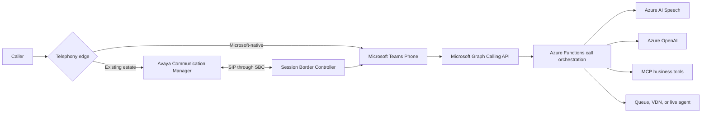

# Replacing Legacy IVR and Call Assistance with AI: What We Learned Building e611-IVR

Traditional interactive voice response systems are dependable, but they are rarely pleasant. Most of us have called a support line, listened to a long menu, selected the closest available option, and still ended up explaining the issue again after reaching an agent.

That experience is not usually caused by poor telephony. It is caused by a gap between what legacy call platforms are designed to process and how people naturally communicate.

We built **e611-IVR** to explore a different approach. Instead of replacing every part of an existing phone environment, we separated the reliable call-control functions from the parts that benefit from AI. The result is a configurable call-assistance platform that can work with an Avaya Communication Manager environment through Session Border Controllers (SBCs), integrate with Microsoft Teams Phone, and use Azure AI services to understand and act on a caller's request.

This is not an argument for putting a language model in charge of every call. It is a practical account of where AI helps, where deterministic software still matters, and how Model Context Protocol (MCP) and agentic patterns can make the platform easier to extend.

## The Problem with the Traditional IVR Model

Legacy IVR platforms are built around decision trees. A caller presses a key, the system follows a branch, and the process repeats until the call reaches a queue, recording, or endpoint. These systems are predictable and operationally familiar, which is why they remain common in enterprise and government environments.

The problem appears when a caller's intent does not fit the tree.

A technician might say, "I am starting the monthly fire suppression test in Building 6." A traditional IVR can ask the technician to select a facility, event type, and department through several menus. It cannot easily understand the complete statement, associate it with the calling location, check whether the event was scheduled, and create a structured record without custom integration work.

Legacy systems also tend to bind telephony, prompts, routing, and business data into one platform. Changing a greeting may require a new recording. Adding a workflow may require specialized vendor skills. Integrating a facilities database or work-order system can become a separate project.

Our goal was not simply to build a better menu. We wanted to move from **menu-driven call routing** to **intent-aware call assistance** while retaining the safeguards expected from an operational phone system.

## Modernize the Intelligence, Not Necessarily the Phone System

One of the most useful design decisions was to treat the telephony entry point as an adapter rather than the center of the application.

Organizations have different starting points. Some have a large investment in **Avaya Communication Manager**, established Vector Directory Numbers (VDNs), call vectors, agent queues, and carrier relationships. Others are standardizing on **Microsoft Teams Phone** with Calling Plans, Operator Connect, or Direct Routing. A modernization effort should not require all of them to adopt the same migration path on day one.

For an Avaya-centered environment, an SBC can provide the controlled SIP boundary between the existing call manager, the carrier, and the Microsoft calling environment. Avaya can continue to own familiar functions such as queues, vectors, and live-agent distribution. The AI-assisted IVR can handle intake and then transfer a call back to an Avaya VDN when a person is needed.

For a Teams-centered environment, a phone number is associated with a Teams resource account and bot registration. Microsoft Graph delivers call notifications to the Azure Functions application, which answers the call, plays prompts, collects input, and transfers or ends the call.

In both cases, the business workflow remains largely the same:

This separation gives us flexibility. A customer can preserve the telephony investments that still work while modernizing how calls are understood, enriched, and routed.

## A Voice Experience Built from AI and Cognitive Services

The AI portion of e611-IVR is a pipeline rather than a single model call.

**Azure AI Speech**, part of the Azure AI services portfolio historically known as Cognitive Services, handles the voice boundary. Speech-to-text converts a caller's words into a transcript, while text-to-speech generates natural prompts from configuration data. Prompt text is stored outside the application, and generated audio can be cached in Azure Blob Storage. That makes routine content changes much faster than recording, editing, and distributing new audio files.

**Azure OpenAI** handles language understanding. The transcript can be classified against configured destinations, and the model returns an intent, confidence score, and routing result. For workflows that need structured information, the model can extract fields such as a facility, event type, location, or requested action from ordinary speech.

That changes the interaction. A caller can describe the reason for calling instead of translating it into a keypad choice. DTMF does not disappear; it remains valuable for automated panels, accessibility, fallback behavior, and workflows where a fixed response is preferable. Speech becomes another input mode rather than an all-or-nothing replacement.

The application also enriches the conversation with data it already has. ANI and ALI records can identify the caller and location. The called number can select a specific menu, business-hours policy, or welcome message. Call history, facility configuration, and external systems add context that a generic voice bot would not have.

## Keeping AI Out of the Wrong Decisions

A responsive voice system cannot wait indefinitely for a model or external service. It also cannot allow a probabilistic response to control every operational decision.

In e611-IVR, **Azure Functions remains the deterministic call orchestrator**. It owns the call state, timeouts, menu transitions, transfers, retries, and fallback behavior. Azure OpenAI is used for bounded tasks such as classification and structured extraction. If confidence is too low, the system follows a configured fallback instead of guessing.

The same principle applies when an integration is unavailable. A failed lookup should not trap a caller in silence. Timeouts, direct-service fallback paths, and transfer-to-human options are part of the design, not afterthoughts.

This boundary is important when modernizing an operational call system:

- Use code for call state, authorization, validation, timeout handling, and mandatory routing rules.
- Use AI for understanding language, extracting useful context, and assisting with ambiguous input.
- Preserve DTMF and human escalation paths.
- Log the input, model result, confidence, selected action, and final disposition for review.

AI expands what the system can understand, but deterministic controls decide what the system is allowed to do.

## Why MCP Matters

As the platform grew, the integration problem became just as important as speech recognition. The IVR needs access to facility records, event schedules, call history, routing policies, and external systems. Implementing each dependency directly inside the call handler would tightly couple AI workflows to databases and APIs.

We introduced **Model Context Protocol (MCP)** as a standard contract for those business capabilities. The current MCP server exposes focused tools such as:

- `facility_record_lookup`
- `check_event_schedule`
- `get_caller_history`
- `route_admin_call`
- `record_call_event`

Each tool has a defined schema, bounded output, and a specific responsibility. The Function App calls these tools explicitly over Streamable HTTP. Microsoft Entra ID and managed identity protect the endpoint, so the applications do not need to exchange shared API keys.

MCP gives us more than an AI integration mechanism. It creates a reusable service boundary. The live IVR, an administrative assistant, an operations dashboard, or a future agent can use the same facility lookup without duplicating Cosmos DB access logic. Tool calls can also be tested, monitored, and authorized independently from the language model.

For the current implementation, MCP does not mean that an autonomous agent controls a live call. The Function App selects specific tools at defined points. That distinction keeps the production path understandable while preparing the system for broader AI scenarios.

## Where Agentic Configuration Fits

An AI agent is useful when a task requires several steps and the correct sequence depends on the information discovered along the way. For example, after a call ends, an agent could retrieve the call record, review relevant facility history, identify missing details, create a summary, and recommend follow-up work.

That flexibility is useful, but it is not appropriate everywhere.

We divide the architecture into two paths:

1. **Critical live-call path:** Azure Functions controls the interaction and invokes approved AI or MCP operations with explicit limits and fallbacks.
2. **Non-critical agentic path:** Agents can analyze completed calls, prepare summaries, identify trends, support supervisors, or coordinate follow-up actions where additional reasoning time is acceptable.

Agent configuration should define which tools are available, what data can be accessed, when human approval is required, and what actions are prohibited. A read-only call-analysis agent should not suddenly gain permission to change routing or notify an external organization. Tool allowlists, managed identities, structured outputs, and audit logs are as important as the prompt.

This selective approach gives us the benefits of agentic systems without turning the call path into an open-ended chain of model decisions.

## What the Architecture Looks Like in Practice

The main application is built with .NET 8 and separates concerns across a few Azure services:

- **Azure Functions** processes call events and executes the call flow.
- **Microsoft Graph Calling API** provides call control for the Teams integration.
- **Azure AI Speech** provides speech-to-text and text-to-speech.
- **Azure OpenAI** classifies intent and extracts structured data.
- **Azure Cosmos DB** stores menus, prompts, ANI/ALI records, routing configuration, and call logs.
- **Azure Blob Storage** stores prompt audio and synthesized-audio cache entries.
- **Azure App Service** hosts the administration portal and MCP server.
- **Application Insights** captures distributed telemetry across the workflow.
- **Bicep** defines repeatable infrastructure for deployment.

Configuration is data-driven. Different phone numbers can have different menu trees, prompts, business hours, and routing policies without creating separate applications. External actions can submit structured data to work-order, alarm, scheduling, or other line-of-business APIs.

For local development, a PSTN simulator stands in for Teams and Microsoft Graph. That lets us exercise call events, DTMF, speech transcripts, prompt playback, and external-system workflows without a live phone number or telephony hardware. This has been especially valuable because voice applications are event-driven and difficult to debug one webhook at a time.

## Lessons from the Build

The first lesson is that replacing a legacy IVR does not require replacing the entire telephony estate. Keeping Avaya or another call manager at the edge may be the right operational choice. An SBC and a clear adapter boundary allow the intelligent workflow to evolve independently.

The second lesson is that AI works best when its assignment is narrow. "Understand what this caller is asking for" is a good model task. "Own the call, decide every action, and recover from every failure" is not. The latter belongs to deterministic orchestration.

The third lesson is that configuration and observability determine whether an AI prototype can become an operational system. Prompts, confidence thresholds, routing rules, tool permissions, timeouts, and fallback actions need to be visible and manageable. Every important decision needs enough telemetry to explain what happened later.

Finally, MCP and agents solve different problems. MCP gives the system consistent, secure tools. Agents provide a reasoning loop that can choose among tools. We can adopt the first without immediately putting the second in the critical path.

## A More Practical Definition of IVR Modernization

For us, modernizing IVR means more than adding speech recognition to an old menu tree. It means building a call-assistance layer that can understand natural language, combine it with trusted business data, take bounded actions, and hand the call to the right human when judgment is required.

It also means respecting the environment already in place. An organization should be able to begin with Avaya and SBC-based routing, adopt Teams integration where it makes sense, and expand AI capabilities without rewriting the business workflow each time the telephony architecture changes.

e611-IVR is our implementation of that idea. Azure AI Speech gives the system a voice and an ear. Azure OpenAI helps it interpret intent. MCP provides a consistent way to reach business systems. Selective agentic workflows create room for deeper analysis and automation. Azure Functions keeps the live experience controlled and predictable.

That combination is how we are moving from legacy call trees toward call assistance that is more natural for callers, more useful to operators, and flexible enough to meet organizations where they are.

## Continue Exploring

For implementation details, see the project documentation:

- [System architecture](architecture.md)
- [Teams integration field guide](FS_Teams_Integration.md)
- [AI architecture and agentic strategy](AI-MCP-agentic-config.md)
- [MCP workflow guide](MCP_workflow.md)
- [PSTN simulator](pstn-simulator.md)
